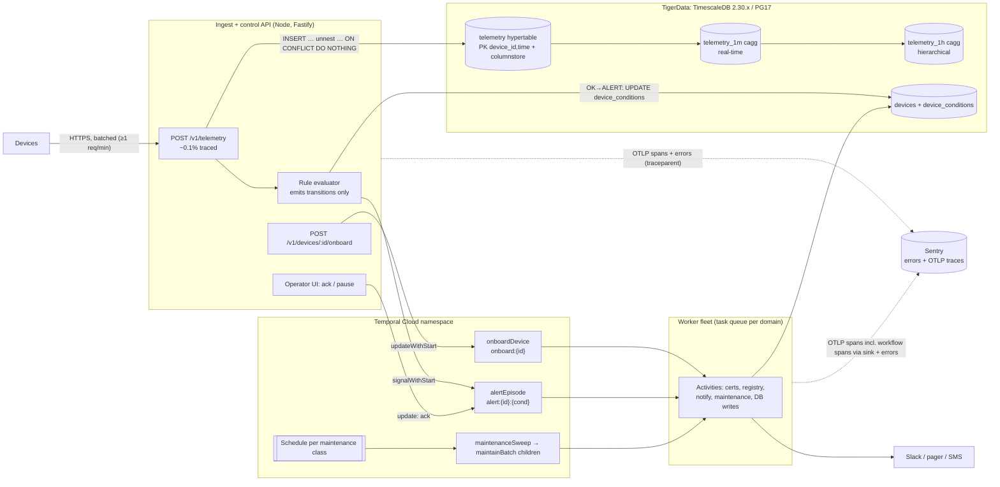

# Device Fleet Ops: Implementation Research

**Stack (fixed):** Temporal (orchestration), Sentry (tracing and errors), TigerData/TimescaleDB (storage)
**Language:** TypeScript (API, workers, activities)
**Research date:** 2026-10-03. All links were accessed on 2026-10-03 unless marked otherwise.

**Method.** Four research passes ran in parallel, one each for Temporal, Sentry, TigerData, and cost/ops. Each pass was written from primary sources first: official docs, release notes, and source code read on GitHub, unpkg and npm. Forums, Hacker News and postmortems were used to find failure modes. Sections 1–4 are the synthesis, including fixes where the passes contradicted each other. Sections 5–8 are the detailed findings for each tool. Labels used throughout:

- **[unverified]**: could not be confirmed from a primary source.
- **est.**: a derived number.
- *(design inference)*: our recommendation, not a documented vendor pattern.

**Context note.** The TypeScript implementation of this design lives in `src/` and `schema.sql` in the `D:\ockto` repo; see its README.

---

## 1. Executive summary: the decisions

1. **Telemetry never flows through Temporal.** The path is: device → batched HTTPS ingest → TimescaleDB. A rule evaluator emits only **state transitions** (first heartbeat, OK→ALERT, ALERT→OK) into Temporal. Four constraints force this:
   - Temporal's CTO advises at most ~10 requests/s sustained per workflow ([forum](https://community.temporal.io/t/event-routing-for-high-frequency-events/19146)).
   - Executions are terminated past 10,000 signals or 51,200 events ([event history](https://docs.temporal.io/workflow-execution/event), [limits](https://docs.temporal.io/workflow-execution/limits)).
   - Every signal is a billed Action ([Actions](https://docs.temporal.io/cloud/actions)).
   - Details in §5.3.1.
2. **Use bounded workflows per process, not one long-lived workflow per device.** Details in §5.3.
   - **Onboarding:** workflow ID `onboard:{deviceId}`, started via Update-with-Start with `USE_EXISTING` and `ALLOW_DUPLICATE_FAILED_ONLY`.
   - **Alerts:** workflow ID `alert:{deviceId}:{condition}`, started via Signal-with-Start, with escalation timers and an ack *update*.
   - **Maintenance:** one Schedule per maintenance class runs a sweep workflow, which starts child workflows per batch and then continues-as-new.
   - **Device state of record** lives in Postgres/TimescaleDB, not in workflow state.
3. **Versioning.** Default to **Worker Versioning, PINNED**. It is GA in the TS SDK since 1.15.0 and in server APIs since 1.31.0 ([worker versioning](https://docs.temporal.io/production-deployment/worker-deployments/worker-versioning)).
   - Use `patched()` for anything AUTO_UPGRADE.
   - Run **replay tests in CI** against exported production histories. Pass the *real* workflow IDs, because they default to `'fake'`, and use the *same interceptors* as production. Details in §5.4.
4. **There is no official Sentry–Temporal integration** in any language ([sdk-typescript#1172](https://github.com/temporalio/sdk-typescript/issues/1172)). The pattern that works with **Sentry JS v11** (released 2026-09-23, no longer OpenTelemetry-based) is:
   - You own **one OTel NodeSDK**, exporting OTLP to Sentry.
   - Temporal's `@temporalio/interceptors-opentelemetry-v2` `OpenTelemetryPlugin` shares that same span processor.
   - `Sentry.openTelemetryIntegration()` stamps error events with the active span.
   - **W3C `traceparent` is used everywhere.**
   - A Sentry activity interceptor is registered as a plugin *after* the OTel plugin, and workflow failures reach Sentry through a **sink**.
   - Details in §6.
5. **Telemetry schema.** Details in §7.
   - **Table:** a *wide* hypertable with an `int4 device_id` and `PRIMARY KEY (device_id, time)`. That key handles both deduplication and per-device lookups.
   - **Compression:** columnstore with `segmentby device_id`, `orderby time DESC`.
   - **Chunk interval** is sized so active-chunk indexes fit in `shared_buffers`: 1 day / 4 h / 1 h at 10k / 100k / 1M devices sampling every 10 s.
   - **Rollups:** a 1-min continuous aggregate with real-time on, feeding a hierarchical 1-h continuous aggregate, both storing `count/sum/min/max/last`.
   - **Retention chain:** raw retention > 1-min `start_offset`, and 1-min retention > 1-h `start_offset`. Anything else silently deletes rollups.
6. **Version pins (2026-10-03):**
   - Temporal TS SDK **1.24.0**, server **1.32.0**, CLI **1.9.1**.
   - `@sentry/node` **11.4.0**.
   - `@temporalio/interceptors-opentelemetry-v2` **1.24.0**.
   - TimescaleDB **≥ 2.30.1** (2.30.2 latest) on **PostgreSQL 17**. Version 2.30.1 fixes a missed-conflict bug in `ON CONFLICT` ([#10580](https://github.com/timescale/timescaledb/blob/main/CHANGELOG.md)).
   - Avoid concurrent *local* activities on TS ≥ 1.23 until [#2455](https://github.com/temporalio/sdk-typescript/issues/2455) is fixed.
7. **Cost (est.).** Fully managed (Temporal Cloud + Sentry SaaS + Tiger Cloud) costs about **$0.7–1.3k / $3.1–4.0k / $14–16k per month** at 10k / 100k / 1M devices sampling every 10 s. That is roughly **$0.015 per device per month** at 1M. Details in §8.4.
   - Self-hosting **Temporal or Sentry never pays off** in this range once ops time is counted.
   - **TimescaleDB** is the only real candidate for self-hosting, and only from roughly 1.3–3M devices, depending on rollup retention (§3c).
   - **Rollup retention is the biggest single cost lever.**
8. **Market check.** No off-the-shelf fleet platform replaces durable onboarding, alert and maintenance orchestration. AWS IoT Core, Azure IoT Hub, balena, Golioth and similar platforms cover connectivity and OTA updates at $0.25–6 per device per month, so they can serve as an ingress edge but not as a replacement (§8.6).

---

## 2. Reference architecture



**Layer boundaries.** Everything in this list is *(design inference)* unless it carries a citation.

- **Ingest API**
  - Validates device credentials and batches readings.
  - Writes with `INSERT … SELECT FROM unnest(…) ON CONFLICT DO NOTHING`. TigerData's benchmark favours prepared `INSERT … UNNEST` for batches under 10k rows; binary `COPY` is faster above that but can't do `ON CONFLICT` ([batch ingest benchmark](https://www.tigerdata.com/blog/benchmarking-postgresql-batch-ingest)).
  - Traces at most ~0.1% of telemetry requests (§6.8).
- **Rule evaluator**
  - Runs in the ingest path, or in a consumer when a broker is added later.
  - Keeps per-(device, condition) state in a small `device_conditions` table and updates it **only on a transition**, with `UPDATE … WHERE state <> $new RETURNING`. That conditional update is the single dedupe point.
  - Only a returned row triggers `signalWithStart`. Never signal per reading.
  - **Simpler alternative:** evaluate thresholds against `telemetry_1m` once a minute from a scheduled job. This adds about 1–2 minutes of alert latency and almost no ingest load.
- **Temporal**
  - Holds only business processes. Activities do all I/O and use **business-key idempotency keys**, not runId + activityId, which change on reset or continue-as-new (§5.3.3).
  - Separate task queues per domain (`device-lifecycle`, `alerts`, `maintenance`) isolate retry storms (§5.6).
- **Sentry**
  - Receives OTLP traces from the API and workers, plus error events linked to the active span.
  - Workflow spans leave the V8 isolate through Temporal's `exporter` sink.

---

## 3. Where the four research passes disagreed, and the resolution

| # | Conflict | Resolution |
|---|---|---|
| a | **OTel interceptor package.** The Temporal pass left the v1-vs-v2 choice open. The Sentry pass found that Sentry v11 no longer ships an OTel SDK, so it doesn't decide the choice. | Use **`@temporalio/interceptors-opentelemetry-v2`** (OTel JS v2) from day one. Its histories are incompatible with v1, so switching later can break replay ([README](https://github.com/temporalio/sdk-typescript/tree/main/contrib/interceptors-opentelemetry-v2)). It is marked *experimental*: pin the exact version and replay-test every bump. |
| b | **SDK version.** The Temporal pass suggested staying on 1.22.x because of [#2455](https://github.com/temporalio/sdk-typescript/issues/2455) (concurrent local activities cause replay errors on ≥1.23). The Sentry pass relies on 1.24.0, whose v2 package isolates span-ID generation from the workflow's random numbers (fixing [#2023](https://github.com/temporalio/sdk-typescript/issues/2023)). | Use **1.24.0 with no concurrent local activities** (regular activities only) until the sdk-rust fix ships. The CI replay suite is the backstop. |
| c | **Rollup retention.** The cost model kept 1-min rollups for **1 year**, giving about 19 TB at 1M devices. The schema pass recommends **90 / 30 / 14 days** of 1-min rollups and 3 / 3 / 2 years of 1-h rollups. | Use the schema-pass retention. Recomputed with the cost pass's own bytes-per-row (est.), 1M devices every 10 s: raw 7 d ≈ 2.2 TB (7 × 1,296 GB / 10 + 1 day hot), 1-min 14 d ≈ 0.5 TB, 1-h 2 y ≈ 0.44 TB, **total ≈ 3.1 TB instead of 19 TB**. Tiger Cloud then costs about $8.48k compute + 3.1 TB × $0.212 × 2 ≈ $1.31k storage ≈ **$9.8k/mo, down from $11.7k**. Self-hosted infra is about **$3.45k, down from $7.05k**. The managed premium becomes about $6.4k, against about $8.3k of ops time, so the TimescaleDB crossover moves from roughly 2–3M **down to about 1.3–1.5M devices**. Shorter retention favours self-hosting, because compute then dominates the managed bill. |
| d | **Alert trigger snippet.** The Sentry pass's API example (§6, code B) signals `alert-${deviceId}` on every breaching reading. | Follow §5.3.3: workflow ID `alert:${deviceId}:${conditionKey}`, triggered **only on a transition**. That snippet exists to show the *trace-linking* pattern (a new root span with a link), not the alert design. |
| e | **Task queues.** The Sentry worker example uses one `device-ops` queue. | Use **one queue per domain** (§5.6, retry-storm row). The interceptor and plugin wiring is the same. |
| f | **Ingest trace sampling.** The cost pass modelled 1%, dropping to 0.1% at 1M devices; the Sentry pass uses 0.1%. | Use **0.1% for telemetry, 100% for alert/onboarding roots**, and tune using Sentry's span bill (§8.4c). At 1M devices, 1% would cost about $3.5–7.2k/mo against about $0.7–1.6k at 0.1% (est.). |
| g | **Row size.** The schema pass uses about 110 B heap + 62 B index per row; the cost pass uses about 150 B including the index. | Same order of magnitude. Read all storage figures as **±30%** and measure with `hypertable_columnstore_stats()` once real data flows. |
| h | **Compression ratio.** The docs claim 90–98%; Tiger's pricing page assumes 5×. | Both passes budget **10×**. That is unverified for noisy float sensors, so load-test with representative data. |

---

## 4. Production failure modes of the three-tool combination

Each row below is a documented incident or bug, or a direct consequence of one. These are the ones that only appear when the three tools run together.

| # | Failure | Layers | How it shows up | Detect | Mitigation | Source |
|---|---|---|---|---|---|---|
| 1 | Telemetry routed into workflows as signals | Ingest → Temporal | APS throttling (`ResourceExhausted`), Action bill spike, execution **terminated** at 10k signals | Temporal `approximate_backlog_count`, Cloud APS usage | Transitions only (§2); continue-as-new on `continueAsNewSuggested` | [forum](https://community.temporal.io/t/scenario-workflow-with-frequent-signals-received/1879), [event history](https://docs.temporal.io/workflow-execution/event) |
| 2 | Non-determinism errors (NDE) after an SDK or interceptor change | Temporal ↔ tracing | Workflows stuck Running after a deploy; workflow-task retries loop | Replay CI; worker runtime logs forwarded to Sentry | Pin `@temporalio/*` to one exact version; replay with the same interceptors; never swap OTel v1↔v2 on live histories | [#1582](https://github.com/temporalio/sdk-typescript/issues/1582), [#1677](https://github.com/temporalio/sdk-typescript/issues/1677), [#2023](https://github.com/temporalio/sdk-typescript/issues/2023) |
| 3 | `@sentry/node` reachable from workflow code | Sentry → Temporal bundle | Worker fails at bundle time with disallowed modules (`os`, `fs`, `http`) | Build fails | Keep `@sentry/*` out of `workflowsPath`/`workflowModules`; use `import type` for sinks | [forum #8423](https://community.temporal.io/t/is-it-possible-to-intercept-workflow-exceptions-and-send-them-to-sentry/8423) |
| 4 | Trace splits at the isolate | Sentry ↔ Temporal | Activity spans start new traces; errors don't link back to the API request | Sentry trace view shows orphan `RunActivity` roots | W3C `traceparent` everywhere; no Sentry-owned propagator on workers | §6.4.2 (source-verified) |
| 5 | One Sentry event per retry attempt | Sentry ↔ Temporal | Quota burn and alert fatigue; default retry policy is **unlimited** | Sentry event volume per issue | Report on non-retryable, final, or "stuck" attempt (5); fingerprint by `workflowType+activityType+errorType` | §6.7, [retry policies](https://docs.temporal.io/encyclopedia/retry-policies) |
| 6 | Duplicate rows from activity retries | Temporal → TimescaleDB | Rollup `count`/`sum` inflated | Data checks against `n` | `PK (device_id, time)` + `ON CONFLICT DO NOTHING`; event time fixed in workflow code (`workflow.now()`); TimescaleDB **≥ 2.30.1** | [CHANGELOG #10580](https://github.com/timescale/timescaledb/blob/main/CHANGELOG.md) |
| 7 | Columnstore conversion blocks dashboards and ingest | TimescaleDB | Queries queue behind AccessExclusiveLock during truncate | `pg_locks`, slow-query logs, Sentry spans on dashboard endpoints | Convert only past the lateness horizon; `lock_timeout` on dashboard roles; consider `compress_truncate_behaviour = truncate_or_delete` | [#2732](https://github.com/timescale/timescaledb/issues/2732), §7.3 |
| 8 | Retention silently deletes rollups | TimescaleDB | Rollups vanish beyond the raw-retention window | CI check of the invariants against `timescaledb_information.jobs` | `raw.drop_after > 1m.start_offset`, `1m.drop_after > 1h.start_offset` | [#4328](https://github.com/timescale/timescaledb/issues/4328) |
| 9 | Background workers starved, so rollups go stale and alerts evaluate stale data | TimescaleDB → alerts | "failed to start a background worker"; caggs lag | `timescaledb_information.job_stats` (`last_run_status`, `next_start`) | Size `max_worker_processes` ≥ TimescaleDB workers + parallel workers; watch pgtune overrides | [#7602](https://github.com/timescale/timescaledb/issues/7602) |
| 10 | Pooled backend rejects upserts with a license error | TimescaleDB → activities | Activity retries forever on SQLSTATE `0A000` → Sentry "stuck attempt" event | Sentry issue grouped by `errorType` | Recycle connections on `0A000`; avoid aggressive `statement_timeout` on fresh pooled connections | [#10711](https://github.com/timescale/timescaledb/issues/10711) (open) |
| 11 | Late data after a long outage | Temporal → TimescaleDB | Events land with old timestamps; refresh window misses them; DML into compressed chunks hits the 100k-tuple guard | Cagg vs raw count mismatch | `start_offset` ≥ max lateness; batch late writes under 100k rows; pause the policy for big backfills | §7.3, §7.4 (we reproduced the late-landing behaviour in the Python proof) |
| 12 | Worker OOM | Temporal workers | Pod OOMKilled; workflow cache thrash; slow replays | Container memory vs heap | Set `maxCachedWorkflows` explicitly (isolates use memory outside the V8 heap) | [forum 2025-11-27](https://community.temporal.io/t/default-maxcachedworkflows-calculation-doesnt-account-for-vm-isolate-memory-being-outside-v8-heap/18704) |
| 13 | Alert traces dropped by sampling | Sentry ↔ ingest | An alert started from an unsampled telemetry request inherits "unsampled" | Missing alert traces | Start the Temporal call in a **new root span with a link** to the request span | §6.5 |
| 14 | Lost spans and errors on shutdown | Sentry ↔ workers | Workflow spans in the `BatchSpanProcessor` and pending errors vanish on deploy | Gaps around deploy times | `await Sentry.close()` and `otelSdk.shutdown()` after `worker.run()` resolves | §6.9 |
| 15 | Telemetry arrays passed as workflow payloads | Temporal | 2 MB payload error; task fails *retryably* (TS ≥ 1.21) | `[TMPRL1103]` warnings | Pass device IDs or object-store keys, never readings | [v1.21.0](https://github.com/temporalio/sdk-typescript/releases/tag/v1.21.0) |

**Load-test before committing to the 1M tier:**

- whether the single-threaded columnstore job keeps up with about 360M rows/hour;
- the 1-min refresh runtime at that scale;
- the real compression ratio on your sensor data;
- ingest throughput with the unique PK (vendor guidance is 50–100k rows/s per process);
- Temporal APS during the maintenance sweep fan-out;
- Sentry span volume at the chosen sampling rates.

---

# Detailed findings

## 5. Temporal: workflow architecture, versioning, failure modes

Scope: Temporal TypeScript SDK on the fleet platform (onboarding, alert dispatch, scheduled maintenance). Telemetry ingest is covered only to mark where Temporal should stop. All URLs accessed 2026-10-03. Where a statement is my own design inference rather than a sourced fact, it is labelled *(design inference)*.

### 1. Current versions (verified from release pages / GitHub API)

| Component | Latest stable | Released | Notes | Source |
|---|---|---|---|---|
| TS SDK `@temporalio/*` | **1.24.0** | 2026-09-15 | Adds `ActivityHandle.pause/unpause/updateOptions`; npm `dist-tags.latest` = 1.24.0; `engines.node >= 20.3.0` | [release](https://github.com/temporalio/sdk-typescript/releases/tag/v1.24.0), [npm](https://registry.npmjs.org/@temporalio/workflow), [package.json](https://github.com/temporalio/sdk-typescript/blob/main/packages/worker/package.json) (accessed 2026-10-03) |
| TS SDK 1.23.0 | | 2026-08-26 | **Breaking:** protobufjs v8. Nexus GA. Experimental Event Groups, TypeInfo | [release](https://github.com/temporalio/sdk-typescript/releases/tag/v1.23.0) (accessed 2026-10-03) |
| TS SDK 1.21.0 | | 2026-07-23 | **Breaking:** worker-side payload size validation (over-limit completions fail the task *retryably*, `[TMPRL1103]` warnings). Experimental S3/GCS external payload storage | [release](https://github.com/temporalio/sdk-typescript/releases/tag/v1.21.0) (accessed 2026-10-03) |
| Temporal Server | **1.32.0** (feature); patches 1.31.3 / 1.30.7 (2026-09-18) | 2026-09-11 | Standalone Activities GA, Activity Eager Execution on by default, breaking visibility query-converter changes; legacy Worker Versioning removal moved to **1.33** | [v1.32.0](https://github.com/temporalio/temporal/releases/tag/v1.32.0), [releases API](https://api.github.com/repos/temporalio/temporal/releases) (accessed 2026-10-03) |
| Server 1.31.0 | | 2026-04-29 | **Worker Deployment APIs GA** (were Public Preview since 1.28.0) | [v1.31.0](https://github.com/temporalio/temporal/releases/tag/v1.31.0) (accessed 2026-10-03) |
| Temporal CLI | **1.9.1** | 2026-09-14 | Bundles dev server 1.32.0. `v1.9.2-nexus-handler-callbacks` (2026-10-02) is a pre-release with a 1.33 RC server, so don't use it | [CLI releases](https://github.com/temporalio/cli/releases) (accessed 2026-10-03) |

Pin all `@temporalio/*` packages to exactly the same version. Mixed versions were a first suspect in a replay bug thread ([sdk-typescript#1790](https://github.com/temporalio/sdk-typescript/issues/1790), accessed 2026-10-03).

### 2. Hard limits that shape the design

| Limit | Value | Source |
|---|---|---|
| Event history | Terminated past **51,200 events or 50 MB**. Warnings start at 10,240 events / 10 MB | [Limits](https://docs.temporal.io/workflow-execution/limits), [Event history](https://docs.temporal.io/workflow-execution/event) (accessed 2026-10-03) |
| Continue-as-New suggestion | Server sets `continueAsNewSuggested` at **4,096 events or 4 MB** by default (`limit.historyCount/historySize.suggestContinueAsNew`) | [server dynamic config v1.32.0](https://github.com/temporalio/temporal/blob/v1.32.0/common/dynamicconfig/constants.go) (accessed 2026-10-03) |
| Signals per execution | **10,000**. The execution is *terminated* above this (`history.maximumSignalsPerExecution`) | [Event history](https://docs.temporal.io/workflow-execution/event), [Cloud limits](https://docs.temporal.io/cloud/limits) (accessed 2026-10-03) |
| Updates | 10 in-flight, 2,000 total per execution | [Cloud limits](https://docs.temporal.io/cloud/limits), [self-hosted defaults](https://docs.temporal.io/self-hosted-guide/defaults) (accessed 2026-10-03) |
| Pending activities / children / outgoing signals / cancels | 2,000 each. The docs recommend keeping concurrency at **≤500** | [Platform limits sheet](https://docs.temporal.io/kb/temporal-platform-limits-sheet/) (accessed 2026-10-03) |
| Children per parent | "should not spawn more than 1,000" | [Child Workflows](https://docs.temporal.io/child-workflows) (accessed 2026-10-03) |
| Payload | Errors at 2 MB per payload/request. gRPC message and history transaction limit is 4 MB | [Cloud limits](https://docs.temporal.io/cloud/limits), [self-hosted defaults](https://docs.temporal.io/self-hosted-guide/defaults) (accessed 2026-10-03) |
| Cloud namespace | Default **500 APS** (On-Demand floor; scales from 7-day usage). Schedules: **10 RPS** per namespace. 1 TRU = 500 APS / 1,500 RPS / 4,000 OPS | [Cloud limits](https://docs.temporal.io/cloud/limits), [Capacity modes](https://docs.temporal.io/cloud/capacity-modes) (accessed 2026-10-03) |
| Self-hosted namespace RPS | `frontend.namespaceRPS` = 2,400 **per frontend instance** | [dynamic config v1.32.0](https://github.com/temporalio/temporal/blob/v1.32.0/common/dynamicconfig/constants.go) (accessed 2026-10-03) |

In Cloud, almost everything counts as an Action: workflow starts and completions, timers, activity starts, retries and heartbeats, signals, updates, queries and schedules ([Managing APS](https://docs.temporal.io/best-practices/managing-aps-limits.md), accessed 2026-10-03). When you exceed the limit, the server throttles with `ResourceExhausted`. The result is "increased latency, not lost work" (same source).

### 3. Domain design

#### 3.1 Where Temporal stops: telemetry ingest

Do **not** create a workflow per message, and do not send a signal per message.

- Maxim Fateev (Temporal co-founder/CTO, Jan 2026): "A single workflow execution (instance) has a minimal throughput. I wouldn't use it for anything with sustained throughput over 10 requests per second." He recommended that the high-rate routing component "should not use Temporal" ([forum](https://community.temporal.io/t/event-routing-for-high-frequency-events/19146), accessed 2026-10-03).
- In an IoT geofencing thread, he advised against signalling every 10 s: "Sending a bunch of events that are ignored 99.9% of the time is putting a lot of load on DB". Instead, filter outside Temporal and signal only on meaningful events ([forum](https://community.temporal.io/t/scenario-workflow-with-frequent-signals-received/1879), accessed 2026-10-03).
- "Temporal guarantees that signals are not lost, but too high rate of signals to a single workflow might preclude this workflow from completing" ([forum](https://community.temporal.io/t/ts-sdk-signals-and-continueasnew/4406), accessed 2026-10-03).
- The Entity Workflow pattern page lists "High-frequency updates exceeding 100 per second per entity" as a non-fit ([pattern](https://docs.temporal.io/design-patterns/entity-workflow), accessed 2026-10-03). This conflicts with the 10 rps figure; see the disagreements section.

**The line for this platform** *(design inference from the sources above)*: telemetry goes device → broker → stream consumer → TimescaleDB, with no Temporal in that path. A rule evaluator next to the consumer emits **state transitions only**: first heartbeat seen, OK→ALERT, ALERT→OK. Each transition becomes at most one Temporal start, signal or update. Budget for a per-device lifetime well under 10k signals and far under 1 signal/s.

#### 3.2 Device onboarding

Recommended design:
- **Workflow ID** = `onboard:${deviceId}`. Only one open execution per ID is guaranteed ([Workflow ID](https://docs.temporal.io/workflow-execution/workflowid-runid), accessed 2026-10-03).
- **Start via Update-with-Start** so the API call returns the provisioning result synchronously ("early return"). Use `workflowIdConflictPolicy: 'USE_EXISTING'` so client retries attach to the running onboarding. Set `workflowIdReusePolicy: 'ALLOW_DUPLICATE_FAILED_ONLY'` so a failed onboarding can be retried but a completed one cannot be re-run by accident. A conflict policy is *mandatory* for Update-with-Start. Update-with-Start is **not atomic**: the workflow still starts if the update cannot be delivered ([Sending messages](https://docs.temporal.io/sending-messages), accessed 2026-10-03). It has been non-experimental in TS since 1.12.2 ([release notes](https://github.com/temporalio/sdk-typescript/releases/tag/v1.12.2), accessed 2026-10-03).
- **First heartbeat**: the ingest evaluator sends one `firstHeartbeat` signal. The workflow waits with `condition(fn, timeout)`, which returns `false` on timeout ([workflow API](https://typescript.temporal.io/api/namespaces/workflow), accessed 2026-10-03).
- **Compensation (saga)**: revoke the certificate and delete the registration in reverse order, then throw an **`ApplicationFailure`**. In TS, a non-`ApplicationFailure` thrown from a workflow fails the *Workflow Task*, which retries forever. It does not fail the execution ([failure.ts](https://github.com/temporalio/sdk-typescript/blob/main/packages/common/src/failure.ts), accessed 2026-10-03). The workflow must end in the *Failed* state for `ALLOW_DUPLICATE_FAILED_ONLY` to permit a retry.
- **Secrets**: don't return private keys in the update result. Results are stored in history. Return a secret-store reference, or encrypt with a payload codec (the `encryption` sample) *(design inference)*.

```ts
// src/workflows/onboarding.ts — runs in the V8 sandbox (no Node APIs, no I/O)
import {
  proxyActivities, defineUpdate, defineSignal, setHandler, condition,
  allHandlersFinished, ApplicationFailure, log,
} from '@temporalio/workflow';
import type * as acts from '../activities/onboarding';

export interface OnboardInput { deviceId: string; tenantId: string; model: string }
export interface Provisioned { deviceId: string; certSecretRef: string; mqttEndpoint: string }

export const provision = defineUpdate<Provisioned>('provision');
export const firstHeartbeat = defineSignal<[{ at: string }]>('firstHeartbeat');

const a = proxyActivities<typeof acts>({
  startToCloseTimeout: '30s',
  scheduleToCloseTimeout: '10m', // caps total retry time
  retry: { maximumInterval: '1m', nonRetryableErrorTypes: ['InvalidDeviceError'] },
});

export async function onboardDevice(input: OnboardInput): Promise<void> {
  let result: Provisioned | undefined;
  let failed: string | undefined;
  let seen = false;
  const undo: Array<() => Promise<void>> = [];

  setHandler(provision, async () => {
    await condition(() => result !== undefined || failed !== undefined);
    if (!result) throw ApplicationFailure.nonRetryable(failed!, 'ProvisioningFailed');
    return result;
  });
  setHandler(firstHeartbeat, () => { seen = true; });

  try {
    const cert = await a.issueCertificate(input); // idempotent on deviceId
    undo.unshift(() => a.revokeCertificate(input.deviceId, cert.serial));
    await a.registerDevice({ ...input, certSerial: cert.serial }); // UPSERT keyed by deviceId
    undo.unshift(() => a.deleteRegistration(input.deviceId));
    result = { deviceId: input.deviceId, certSecretRef: cert.secretRef, mqttEndpoint: cert.endpoint };

    if (!(await condition(() => seen, '30 minutes'))) {
      throw ApplicationFailure.nonRetryable('no first heartbeat in 30m', 'FirstHeartbeatTimeout');
    }
    await a.markDeviceActive(input.deviceId);
  } catch (err) {
    failed = String(err);
    log.warn('onboarding failed; compensating', { deviceId: input.deviceId, failed });
    for (const fn of undo) await fn();
    await a.markDeviceFailed(input.deviceId, failed);
    throw ApplicationFailure.nonRetryable(failed, 'OnboardingFailed'); // => execution status Failed
  } finally {
    await condition(allHandlersFinished);
  }
}
```

```ts
// API side: synchronous provisioning response, idempotent on retries
import { Client, WithStartWorkflowOperation } from '@temporalio/client';
import { onboardDevice, provision, type OnboardInput } from './workflows/onboarding';

export async function onboard(client: Client, input: OnboardInput, requestId: string) {
  const startOp = new WithStartWorkflowOperation(onboardDevice, {
    workflowId: `onboard:${input.deviceId}`,
    taskQueue: 'device-lifecycle',
    args: [input],
    workflowIdConflictPolicy: 'USE_EXISTING',
    workflowIdReusePolicy: 'ALLOW_DUPLICATE_FAILED_ONLY',
  });
  // updateId = request id → a retried HTTP call re-attaches to the same update
  return client.workflow.executeUpdateWithStart(provision, { startWorkflowOperation: startOp, updateId: requestId });
}
```

The pattern matches the official `early-return` sample, which uses `new WithStartWorkflowOperation(...)` plus `executeUpdateWithStart` ([sample](https://github.com/temporalio/samples-typescript/blob/main/early-return/src/run-workflow.ts), accessed 2026-10-03). If an execution already holds the same Update ID, the call attaches to that update whatever the conflict policy ([Sending messages](https://docs.temporal.io/sending-messages), accessed 2026-10-03).

**Signal vs update**: use an update when the caller needs a result or a validation rejection. Validators run before anything is written to history, and a rejected update is not recorded ([TS message passing](https://docs.temporal.io/develop/typescript/message-passing), accessed 2026-10-03). Use a signal for fire-and-forget events from the ingest side, such as `firstHeartbeat`.

#### 3.3 Alert dispatch

- **Dedupe by workflow ID**: `alert:${deviceId}:${conditionKey}`, started with **Signal-with-Start**. While an episode is open, repeated alerts become signals to it (a counter increment). After it closes, the next alert starts a new episode under the default `ALLOW_DUPLICATE`. Signal-with-Start is atomic, unlike Update-with-Start ([Sending messages](https://docs.temporal.io/sending-messages), accessed 2026-10-03).
- **Escalation**: a ladder of `notify` activities, each followed by `condition(() => acked, timeout)`.
- **Ack** via an Update with a validator, which rejects a second ack without writing history.
- **Idempotency keys**: the docs suggest Run ID + Activity ID ([Activity definition](https://docs.temporal.io/activity-definition), accessed 2026-10-03). Run IDs change on reset and continue-as-new, so a reset would re-page. Use a business key such as `${workflowId}:L${level}` and dedupe at the notification provider *(design inference)*.
- Keep each episode far below the 10k-signal termination limit. The evaluator must emit transitions, not samples.

```ts
// src/workflows/alert.ts
import { proxyActivities, defineSignal, defineUpdate, defineQuery, setHandler,
  condition, sleep, allHandlersFinished, workflowInfo, patched } from '@temporalio/workflow';
import type * as acts from '../activities/notify';

export interface AlertEvent { deviceId: string; conditionKey: string; severity: 'warn' | 'crit'; value: number; observedAt: string }
export const alertRaised = defineSignal<[AlertEvent]>('alertRaised');
export const ack = defineUpdate<{ level: number }, [{ user: string }]>('ack');
export const state = defineQuery<{ count: number; level: number; ackedBy?: string }>('state');

const { notify } = proxyActivities<typeof acts>({
  startToCloseTimeout: '15s',
  scheduleToCloseTimeout: '5m', // give up on a channel after 5m; escalation continues
  retry: { maximumInterval: '30s', nonRetryableErrorTypes: ['InvalidRecipient'] },
});

const LADDER = [
  { channel: 'slack', ackWithin: '10 minutes' },
  { channel: 'pager:primary', ackWithin: '15 minutes' },
  { channel: 'pager:secondary', ackWithin: '30 minutes' },
] as const;

export async function alertEpisode(first: AlertEvent): Promise<void> {
  let count = 0; // first signal from signalWithStart arrives in the first workflow task
  let last = first;
  let level = 0;
  let ackedBy: string | undefined;

  setHandler(alertRaised, (e) => { count++; last = e; });
  setHandler(ack, ({ user }) => { ackedBy = user; return { level }; },
    { validator: () => { if (ackedBy) throw new Error('already acknowledged'); } });
  setHandler(state, () => ({ count, level, ackedBy }));

  const { workflowId } = workflowInfo();
  for (; level < LADDER.length && !ackedBy; level++) {
    const step = LADDER[level];
    await notify({ idempotencyKey: `${workflowId}:L${level}`, channel: step.channel, alert: last, repeats: count });
    await condition(() => ackedBy !== undefined, step.ackWithin);
  }
  await sleep('30 minutes'); // suppression window: duplicates keep landing here as signals
  await condition(allHandlersFinished);
}
```

```ts
// rule evaluator (outside Temporal) on an OK→ALERT transition
await client.workflow.signalWithStart(alertEpisode, {
  workflowId: `alert:${e.deviceId}:${e.conditionKey}`,
  taskQueue: 'alerts', args: [e], signal: alertRaised, signalArgs: [e],
});
// operator UI
await client.workflow.getHandle(`alert:${id}:${cond}`).executeUpdate(ack, { args: [{ user: 'alice' }] });
```

#### 3.4 Scheduled maintenance

Use **Schedules**, not `cronSchedule`. The TS docs say "We recommend using Schedules instead of Cron Jobs" ([TS schedules](https://docs.temporal.io/develop/typescript/schedules), accessed 2026-10-03). Defaults:
- Overlap is **Skip**.
- The catchup window is **1 year**, with a minimum of 10 s.
- `pauseOnFailure` is false.
- The action's timestamp is appended to the workflow ID.
- A schedule is internally implemented as a workflow.

Sources: [Schedules](https://docs.temporal.io/schedule), [ScheduleOptions](https://typescript.temporal.io/api/interfaces/client.ScheduleOptions) (accessed 2026-10-03).

| Option | Pros | Cons |
|---|---|---|
| One schedule per device | Per-device cadence; easy pause per device | Many schedules firing together hit the Cloud **10 RPS schedule limit** and APS. Needs jitter. "There is no limit on the number of schedules", but burst rate matters ([forum](https://community.temporal.io/t/temporal-limit-on-number-of-schedules/12498), [Cloud limits](https://docs.temporal.io/cloud/limits), accessed 2026-10-03) |
| **One schedule per maintenance class → sweep workflow → child workflow per batch** (recommended) | Few schedules. Batching cuts APS, and the docs advise "batch work within Child Workflows rather than creating one per item" ([APS](https://docs.temporal.io/best-practices/managing-aps-limits.md), accessed 2026-10-03) | Sweep must page through devices and continue-as-new. Children per parent ≤1,000 |

Policies: `overlap: SKIP` so a slow sweep is never doubled. Use a short `catchupWindow`, since a 1-year catch-up after an outage is rarely wanted for maintenance. Add `jitter`. The pattern for windowed child fan-out with continue-as-new is the `batch-sliding-window` sample ([README](https://github.com/temporalio/samples-typescript/tree/main/batch-sliding-window), accessed 2026-10-03).

```ts
import { Client, ScheduleOverlapPolicy } from '@temporalio/client';
import { maintenanceSweep } from './workflows/maintenance';

await client.schedule.create({
  scheduleId: 'maint:firmware-health:nightly',
  spec: { calendars: [{ hour: 2, minute: 0, comment: '02:00 UTC' }], jitter: '10 minutes' },
  action: { type: 'startWorkflow', workflowType: maintenanceSweep, taskQueue: 'maintenance',
            args: [{ kind: 'firmware-health', batchSize: 500 }] },
  policies: { overlap: ScheduleOverlapPolicy.SKIP, catchupWindow: '1 hour', pauseOnFailure: true },
});
```

```ts
// src/workflows/maintenance.ts — sweep: page IDs (small payloads), fan out batches, continue-as-new
import { proxyActivities, executeChild, continueAsNew, workflowInfo } from '@temporalio/workflow';
import type * as acts from '../activities/maintenance';
const { listDeviceIds } = proxyActivities<typeof acts>({ startToCloseTimeout: '1m' });

export async function maintenanceSweep(a: { kind: string; batchSize: number; cursor?: string }): Promise<void> {
  let cursor = a.cursor;
  for (let round = 0; round < 50; round++) { // ponytail: sequential batches; add a sliding window if sweeps run long
    const page = await listDeviceIds(a.kind, cursor, a.batchSize);
    if (page.ids.length === 0) return;
    await executeChild(maintainBatch, {
      workflowId: `${workflowInfo().workflowId}:${cursor ?? 'start'}`, args: [a.kind, page.ids],
    });
    cursor = page.nextCursor;
  }
  await continueAsNew<typeof maintenanceSweep>({ ...a, cursor });
}
export async function maintainBatch(kind: string, ids: string[]): Promise<void> { /* activities per batch */ }
```

#### 3.5 Long-lived per-device entity workflows

Temporal runs "billions of open workflows" ([forum, Maxim 2024-09-03](https://community.temporal.io/t/perpetual-workflows-one-per-customer/13374), accessed 2026-10-03), and the docs list IoT devices as a fit ([Entity pattern](https://docs.temporal.io/design-patterns/entity-workflow), accessed 2026-10-03).

| Pros | Cons |
|---|---|
| Serialises per-device operations (firmware, decommission, config push) | Must continue-as-new. Pending signals must be drained first ("You will lose any pending Signals ... unless you drain", [blog](https://temporal.io/blog/very-long-running-workflows), accessed 2026-10-03) |
| Durable per-device timers (cert rotation, warranty) | Versioning burden. Pinned runs can outlive their deployment version ([Worker Versioning](https://docs.temporal.io/production-deployment/worker-deployments/worker-versioning), accessed 2026-10-03) |
| Queryable live state | Every signal and timer counts toward APS and history. Replay of a large history is slow on cache miss |

Recommendation *(design inference)*: keep device state of record in TimescaleDB/Postgres. Model processes as bounded workflows (`onboard:`, `fw:`, `decom:` + deviceId). Add an entity workflow only if you need serialised long-running orchestration. If you do:
- Loop on `workflowInfo().continueAsNewSuggested`, or `historyLength` / `historySize`.
- Never continue-as-new from a handler. `await condition(allHandlersFinished)` first ([TS continue-as-new](https://docs.temporal.io/develop/typescript/continue-as-new), accessed 2026-10-03).
- Carry update IDs across runs for dedupe (`currentUpdateInfo()`).
- Use AUTO_UPGRADE + `patched()` (§4).

### 4. Versioning without breaking in-flight runs

| Approach | How | Fits | Status / source |
|---|---|---|---|
| `patched(id)` → `deprecatePatch(id)` → remove | `patched` writes a marker. Old histories take the old branch | Long-lived / AUTO_UPGRADE workflows | Stable. [TS versioning](https://docs.temporal.io/develop/typescript/versioning) (accessed 2026-10-03) |
| **Worker Versioning: PINNED** | Each run completes on the Deployment Version (deploymentName + buildId) it started on. No patching needed | Short/bounded: onboarding, alert episodes, maintenance batches | **GA** on Cloud. Self-hosted needs ≥1.29.1 (docs); server APIs GA in 1.31.0. TS SDK: **GA since 1.15.0 (2026-02-18)** ([release](https://github.com/temporalio/sdk-typescript/releases/tag/v1.15.0), [docs](https://docs.temporal.io/production-deployment/worker-deployments/worker-versioning), accessed 2026-10-03) |
| **Worker Versioning: AUTO_UPGRADE** | Moves to the current version on its next task. Still needs patching | Entity workflows | Same as above |
| Upgrade-on-Continue-as-New | Pinned run checks `targetWorkerDeploymentVersionChanged`, then CANs with `initialVersioningBehavior: 'AUTO_UPGRADE'` | Entity workflows wanting pinned semantics | **Public Preview / `@experimental`** in TS ([docs](https://docs.temporal.io/production-deployment/worker-deployments/worker-versioning/upgrade-on-continue-as-new), [interfaces.ts](https://github.com/temporalio/sdk-typescript/blob/main/packages/workflow/src/interfaces.ts), accessed 2026-10-03) |
| New workflow type name (`AlertEpisodeV2`) | Register both. New starts use V2 | Big rewrites | Duplicates code and changes callers ([TS versioning](https://docs.temporal.io/develop/typescript/versioning), accessed 2026-10-03) |

How Worker Versioning behaves:
- A version moves through Inactive → Active → Draining → Drained. You can retire it once it is Drained ([Worker Versioning](https://docs.temporal.io/worker-versioning), accessed 2026-10-03).
- Promote with `temporal worker deployment set-current-version --deployment-name … --build-id …` ([CLI ref](https://docs.temporal.io/cli/command-reference/worker), accessed 2026-10-03). The ramping flags are **[unverified]**.
- On Kubernetes, the **Temporal Worker Controller** automates rainbow deploys and sunsetting. It warns that idle pinned workflows "don't automatically detect version changes" ([blog 2026-04-22](https://temporal.io/blog/safe-deployments-with-temporal-worker-versioning-on-kubernetes), accessed 2026-10-03).
- The legacy `buildId`/`useVersioning` options are `@deprecated` in TS ([WorkerOptions](https://typescript.temporal.io/api/interfaces/worker.WorkerOptions), accessed 2026-10-03). The legacy server APIs are removed in **server 1.33**. Drain any workflows that depend on them before upgrading ([v1.32.0](https://github.com/temporalio/temporal/releases/tag/v1.32.0), accessed 2026-10-03).

```ts
// worker.ts — versioned worker; defaultVersioningBehavior is REQUIRED by the TS type when useWorkerVersioning is true
await Worker.create({
  connection, taskQueue: 'device-lifecycle', workflowsPath: require.resolve('./workflows'), activities,
  workerDeploymentOptions: {
    useWorkerVersioning: true,
    version: { deploymentName: 'fleet', buildId: process.env.GIT_SHA! },
    defaultVersioningBehavior: 'PINNED',
  },
});
// workflows/entity.ts — opt the long-lived workflow out of pinning
setWorkflowOptions({ versioningBehavior: 'AUTO_UPGRADE' }, deviceEntity);
```

```ts
// patched(): add an SMS step before paging, safely for in-flight alert episodes
if (level === 1 && patched('alert-sms-before-pager')) { // marker only written where behaviour changes
  await notify({ idempotencyKey: `${workflowId}:L1:sms`, channel: 'sms', alert: last, repeats: count });
}
// Later, once no pre-patch run is open: replace with deprecatePatch('alert-sms-before-pager') and unconditional code.
// After those runs pass retention: delete deprecatePatch.
```

**Replay testing in CI** (`Worker.runReplayHistory` throws `DeterminismViolationError` or `ReplayError`; `Worker.runReplayHistories` yields `{workflowId, runId, error?}`) ([testing docs](https://docs.temporal.io/develop/typescript/testing-suite), [worker.ts](https://github.com/temporalio/sdk-typescript/blob/main/packages/worker/src/worker.ts), accessed 2026-10-03). The docs advise: replay a representative set of recent open and closed histories per task queue, and "Fail CI if any error is encountered during replay."

The workflow ID trap: histories do not include the workflow ID, and replay defaults it to `'fake'`. Pass the real ID if code derives child IDs or idempotency keys from `workflowInfo().workflowId`, as §3 does. CLI JSON (`temporal workflow show --output json`) is accepted as-is (string event IDs are converted via `historyFromJSON`). Sources: same `worker.ts`.

```ts
// test/replay.test.ts — histories exported nightly as {workflowId, history} JSON files
import { Worker } from '@temporalio/worker';
import { readdir, readFile } from 'node:fs/promises';
import { join } from 'node:path';

test('current workflow code replays production histories', async () => {
  const dir = join(__dirname, 'histories');
  const files = (await readdir(dir)).filter((f) => f.endsWith('.json'));
  const inputs = await Promise.all(files.map(async (f) => JSON.parse(await readFile(join(dir, f), 'utf8'))));
  const failures: string[] = [];
  for await (const r of Worker.runReplayHistories(
    { workflowsPath: require.resolve('../src/workflows') /* + same interceptors as prod */ },
    inputs.map(({ workflowId, history }) => ({ workflowId, history })),
  )) if (r.error) failures.push(`${r.workflowId}: ${r.error.message}`);
  expect(failures).toEqual([]);
});
// Exporter (nightly job): client.workflow.list({ query: 'TaskQueue="alerts" AND StartTime > "…"' }).intoHistories()
```

### 5. TypeScript-specific constraints

- **Sandbox and bundling**:
  - Workflows are webpack-bundled at Worker creation and run in a deterministic V8 sandbox.
  - `Math.random` and `Date` are replaced. `Date.now()` returns the last Workflow Task time and only advances after an `await`.
  - `WeakRef` and `FinalizationRegistry` are removed.
  - Sources: [TS workflow basics](https://docs.temporal.io/develop/typescript/workflows/basics) (accessed 2026-10-03).
  - The bundler allows only Node builtins `assert`, `url` and `util`. `@temporalio/activity`, `@temporalio/client` and `@temporalio/worker` are disallowed in workflow code ([bundler.ts](https://github.com/temporalio/sdk-typescript/blob/main/packages/worker/src/workflow/bundler.ts), accessed 2026-10-03).
  - Import activities as **types only**. Use `bundlerOptions.ignoreModules` only for modules that never run.
  - Use `uuid4()` from `@temporalio/workflow` for IDs.
  - `reuseV8Context` defaults to true ([WorkerOptions](https://typescript.temporal.io/api/interfaces/worker.WorkerOptions), accessed 2026-10-03).
  - Prebundle with `bundleWorkflowCode` for faster startup (`production` sample).
- **Logging, metrics, tracing**:
  - Use `log` from `@temporalio/workflow`, which tries not to re-emit on replay.
  - Sinks (`proxySinks` + `InjectedSinks`, `callDuringReplay: false`) export data one-way. They aren't recorded in history and always run on the same worker ([TS observability](https://docs.temporal.io/develop/typescript/observability), accessed 2026-10-03).
  - `@sentry/node` must not be imported into workflow code. Use sinks or activity interceptors to send to Sentry ([forum](https://community.temporal.io/t/is-it-possible-to-intercept-workflow-exceptions-and-send-them-to-sentry/8423), accessed 2026-10-03).
  - For OTel, `@temporalio/interceptors-opentelemetry` targets OTel JS v1. `-v2` (experimental) targets OTel JS v2 and "produces incompatible histories". Switching packages can cause NDEs ([README](https://github.com/temporalio/sdk-typescript/tree/main/contrib/interceptors-opentelemetry-v2), accessed 2026-10-03). Which OTel major your Sentry SDK uses is **[unverified]** here, so check it before choosing.
- **Activity timeouts**:

| Timeout | Use | Guidance |
|---|---|---|
| startToClose | One attempt | "We strongly recommend setting" it. It is the only way to detect a crashed worker ([Activity failures](https://docs.temporal.io/encyclopedia/detecting-activity-failures), accessed 2026-10-03) |
| scheduleToClose | Whole activity, including retries | Use as the retry budget (e.g. notify: 5m) |
| heartbeatTimeout | Long activities (firmware push, bulk export) | Heartbeats are throttled to min(0.8×timeout, 60 s max). Cancellation is only delivered on heartbeat ([Context API](https://typescript.temporal.io/api/classes/activity.Context), accessed 2026-10-03) |
| scheduleToStart | Rarely | **Not retryable.** Monitor `activity_schedule_to_start_latency` instead (same source) |

- **Retries**:
  - Defaults: 1 s initial, ×2 backoff, max interval 100×initial, **unlimited attempts**. Workflows do not retry by default ([Retry policies](https://docs.temporal.io/encyclopedia/retry-policies), accessed 2026-10-03).
  - Use `ApplicationFailure.nonRetryable(msg, type)` or `nonRetryableErrorTypes` for permanent errors, and `ApplicationFailure.create({ nextRetryDelay })` for provider back-off ([TS timeouts](https://docs.temporal.io/develop/typescript/activities/timeouts), accessed 2026-10-03).
  - Inside activities, use `Context.current().cancellationSignal` (an `AbortSignal`) for `fetch` calls.
- **Payloads**:
  - Server errors at 2 MB. Since TS 1.21, the worker validates sizes and fails over-limit task completions *retryably* ([v1.21.0](https://github.com/temporalio/sdk-typescript/releases/tag/v1.21.0), accessed 2026-10-03).
  - Pass device-ID batches or object-store keys, never telemetry. The blog suggests a blob store above "1-2MB" ([blog](https://temporal.io/blog/very-long-running-workflows), accessed 2026-10-03).

### 6. Temporal-side failure modes and war stories

| Failure mode | How it happens (TS) | Mitigation | Evidence |
|---|---|---|---|
| NDE leaves workflows stuck | Changed command order after deploy. The workflow task retries forever and the execution stays Running | Roll back the worker, then add `patched()` or pinning. Recovery is automatic on the next retry. Optional: `workflowFailureErrorTypes: {'*': ['NondeterminismError']}` (`@experimental`) to fail instead | [Troubleshooting](https://docs.temporal.io/troubleshooting/execution-failures), [worker-options.ts](https://github.com/temporalio/sdk-typescript/blob/main/packages/worker/src/worker-options.ts) (accessed 2026-10-03) |
| **SDK upgrade NDE: OTel interceptors** | OTel interceptor changes in 1.11.5+ reordered signal-with-start handling. Histories from 1.11.2 failed on 1.11.5–1.11.7 | Pin versions. Replay-test before any SDK bump. Keep the same interceptors in the replay worker | [#1582](https://github.com/temporalio/sdk-typescript/issues/1582), [#1677](https://github.com/temporalio/sdk-typescript/issues/1677) (closed 2025-11) (accessed 2026-10-03) |
| OTel + `uuid4()` after query/update-validation | uuid differs on replay. Surfaces only after a cache eviction, "typically hours later, after a pod roll" | Avoid uuid4 after handlers under OTel, or derive IDs from business keys. **Open** | [#2023](https://github.com/temporalio/sdk-typescript/issues/2023) (open; related named-random-streams PR merged 2026-06-01) (accessed 2026-10-03) |
| **≥1.23.0 concurrent local activities** | Concurrent local activities plus an extra microtask hop → replay NDE with the *same* SDK version | Stay on 1.22.x, or avoid concurrent local activities, until the fix (sdk-rust PR #1616) ships. **Open as of 2026-09-29** | [#2455](https://github.com/temporalio/sdk-typescript/issues/2455) (accessed 2026-10-03) |
| History bloat / signal flood | Entity workflow takes per-sample signals → terminated at 51,200 events or 10k signals | Filter upstream. CAN after "a few hundreds of signals" | [forum](https://community.temporal.io/t/handling-large-amounts-of-incoming-signals-in-a-workflow/11475) (accessed 2026-10-03) |
| Worker OOM | Default `maxCachedWorkflows` comes from heap size (~600 WF/GB), but isolates use **native memory outside the heap**. 4.6 GB heap in a 5 Gi pod → ~2,600 cached → OOMKill | Set `maxCachedWorkflows` explicitly. Leave container headroom | [forum 2025-11-27](https://community.temporal.io/t/default-maxcachedworkflows-calculation-doesnt-account-for-vm-isolate-memory-being-outside-v8-heap/18704) (accessed 2026-10-03) |
| Slot exhaustion / backlog | Defaults: 40 WFT slots, 100 activity slots, pollers min(10, slots), sticky schedule-to-start 10 s. `tuner` is mutually exclusive with `maxConcurrent*` | Watch `*_schedule_to_start_latency`, `sticky_cache_*`, `approximate_backlog_count`. Use a resource-based tuner for activities and fixed-size for workflows | [WorkerOptions](https://typescript.temporal.io/api/interfaces/worker.WorkerOptions), [runtime tuning](https://docs.temporal.io/develop/worker-performance/runtime-tuning), [metrics](https://docs.temporal.io/develop/worker-performance/metrics) (accessed 2026-10-03) |
| Retry storms | Unlimited default retries against a dead dependency occupy activity slots on a shared queue | Set `scheduleToCloseTimeout` or `maximumAttempts`. Use separate task queues per dependency | [Perun, 2026-06-30 (generic, not an incident)](https://perun.au/insights/temporal-production/) (accessed 2026-10-03) |
| Rate limiting | Self-hosted `RESOURCE_EXHAUSTED: namespace rate limit exceeded`, driven by heavy List/Query calls more than starts | Find the operations driving it before raising limits. In Cloud, track APS | [forum 2022](https://community.temporal.io/t/resource-exhausted-namespace-rate-limit-exceeded/6244) (accessed 2026-10-03) |
| Workflow ID surprises | Scheduled runs get a timestamp suffix, so a static ID can't be signalled. `ALLOW_DUPLICATE` (default) re-runs completed IDs. Reuse checks only apply within retention | Address scheduled runs through a business-keyed child or a DB lookup. Choose the reuse policy deliberately | [Deriv postmortem (Python)](https://derivai.substack.com/p/learning-temporal-the-hard-way), [Workflow ID](https://docs.temporal.io/workflow-execution/workflowid-runid) (accessed 2026-10-03) |
| Plain `Error` thrown in workflow | Fails the *task* (infinite retry), not the execution | Throw `ApplicationFailure` | [failure.ts](https://github.com/temporalio/sdk-typescript/blob/main/packages/common/src/failure.ts) (accessed 2026-10-03) |

### 7. Reference implementations

`temporalio/samples-typescript` directories (verified via the GitHub contents API, accessed 2026-10-03): `early-return` (Update-with-Start), `message-passing/{introduction,execute-update,safe-message-handlers}`, `signals-queries`, `state`, `continue-as-new`, `schedules`, `batch-sliding-window`, `child-workflows`, `saga`, `patching-api` (v1/v2/v3/vFinal), `worker-versioning`, `sinks`, `custom-logger`, `interceptors-opentelemetry`, `activities-cancellation-heartbeating`, `timer-examples`, `encryption`, `production`, `sleep-for-days`, `polling` ([repo](https://github.com/temporalio/samples-typescript), accessed 2026-10-03). There is no `entity` directory in TS; use `continue-as-new` + `safe-message-handlers`. I found no maintained public IoT/fleet Temporal TS repo **[unverified that none exists]**. The SDK's own replay tests are a good reference ([test-replay.ts](https://github.com/temporalio/sdk-typescript/blob/main/packages/test/src/test-replay.ts), accessed 2026-10-03).

### Where sources disagree or docs are ambiguous

1. **Per-workflow throughput.** Maxim (forum, Jan 2026) says don't exceed ~**10 rps** sustained. The Entity Workflow pattern page treats **>100/s** as the non-fit threshold. Design to the 10 rps figure.
2. **Blob-size warning.** The self-hosted defaults page says "warns at **256 KB**". Server `v1.32.0` code sets `limit.blobSize.warn` = **512 KB**.
3. **Legacy Worker Versioning removal date.** The TS versioning page says removal "in **March 2026**". Server 1.31.0 notes said removal in **1.32.0**. Server 1.32.0 notes say it is now planned for **1.33**.
4. **Minimum TS SDK for Worker Versioning.** The docs say "v1.12 or later". 1.12.0 was *experimental*, GA came in **1.15.0**, and 1.16.0 changed `defaultVersioningBehavior` rules. Use ≥1.15.
5. **`defaultVersioningBehavior`.** The TS "Configure a Worker" example omits it with `useWorkerVersioning: true` and says to set behavior per workflow. The SDK type marks it **required** when versioning is on.
6. **Update-with-Start snippet.** The TS message-passing docs show `new WithStartWorkflowOperation.create(...)`. The API and the official sample use the constructor `new WithStartWorkflowOperation(fn, opts)`; there is no static `create`.
7. **History limit wording.** Docs say 51,200 events. A third-party post says "50,000". The Temporal blog says "50K (51,200)".
8. **Signal cap on self-hosted.** The self-hosted defaults page doesn't list the 10,000-signal termination. The event-history page and server config (`history.maximumSignalsPerExecution=10000`) do.
9. **`TERMINATE_IF_RUNNING`.** The Workflow ID docs list it as a normal reuse policy. The TS SDK marks it `@deprecated` in favour of conflict policy `TERMINATE_EXISTING`.
10. **Continue-as-New threshold.** The docs say to use `continueAsNewSuggested` and give no number. The server defaults are 4,096 events / 4 MB (dynamic config only). The blog says CAN at the 10K warning. Forum advice is "after a few hundreds of signals".
11. **Idempotency key.** The docs recommend Run ID + Activity ID. That key changes on reset/continue-as-new, which matters for side-effecting notifications.
12. **Cloud default APS.** The current limits page says 500. Older indexed snippets say 400 **[unverified: source page now 404]**.
13. **Update-with-Start server requirement.** The docs say self-hosted 1.28 is "recommended", with no explicit minimum stated.

### Unverified

- Exact `set-ramping-version` CLI flags.
- Which OpenTelemetry major the current Sentry Node SDK uses (this decides the `-v2` interceptor choice).
- Whether any public IoT/fleet Temporal TS reference repo exists.
- Cloud-specific overrides of the 4,096-event / 4 MB CAN-suggestion defaults.

---

## 6. Sentry: tracing across the Temporal fleet

Scope: an HTTP ingest API (Fastify on Node) starts or signals workflows through the Temporal client. Workflows run in the worker's V8 isolate, and activities run on the worker fleet. Sentry handles errors and traces. All facts below were checked on 2026-10-03. Code is labelled **[docs-derived]** (adapted from an official sample or doc) or **[my composition]** (my own glue, not taken from any official source).

**TL;DR**

- **Sentry JS v11 shipped on 2026-09-23 and changes the OpenTelemetry story.** Most older blog posts and answers are now wrong:
  - `@sentry/node` 11.x no longer runs on an OTel SDK.
  - `skipOpenTelemetrySetup` is gone, replaced by `enableOpenTelemetrySetup`.
  - `SentrySpanProcessor`, `SentrySampler`, `SentryContextManager` and the custom-setup `SentryPropagator` have been removed.
- **There is no official Sentry integration for Temporal**, in JS or in any other language. Temporal ships a *sample* Sentry interceptor for Python only. Temporal declined to build a TS integration.
- **Recommended setup on v11: you own OpenTelemetry, Sentry handles errors.** One `NodeSDK` and one `BatchSpanProcessor` export to Sentry's OTLP endpoint. The same processor goes into Temporal's `OpenTelemetryPlugin`. Sentry adds `openTelemetryIntegration()` so error events attach to the active OTel span. Everything propagates as W3C `traceparent`, which is the only format the workflow isolate understands.
- **The main pitfall is the propagation format.** Inside the workflow isolate, Temporal hard-codes `W3CTraceContextPropagator`. Sentry's own propagator reads only `sentry-trace`/`baggage`, and writes `traceparent` only when `propagateTraceparent: true`. If you mix them carelessly, the trace splits silently at the isolate boundary.

---

### 1. Current versions (verified on npm and GitHub)

| Package | Latest | Notes |
|---|---|---|
| `@sentry/node` | **11.4.0** (2026-10-02) | 11.0.0 released 2026-09-23. The `v10` dist-tag is still active at **10.76.0** (also 2026-10-02), so v10 is maintained in parallel. Node `>=20.19.0`. ([npm registry](https://registry.npmjs.org/@sentry/node), [GitHub releases](https://github.com/getsentry/sentry-javascript/releases), accessed 2026-10-03) |
| `@sentry/opentelemetry` | 11.4.0 | In v11 it only peer-depends on `@opentelemetry/api ^1.9.0` ([npm registry](https://registry.npmjs.org/@sentry/opentelemetry), accessed 2026-10-03) |
| `@temporalio/interceptors-opentelemetry` | **1.24.0** (2026-09-15) | Targets the **OTel JS SDK v1** (`@opentelemetry/sdk-trace-base ^1.25.1`) ([npm registry](https://registry.npmjs.org/@temporalio/interceptors-opentelemetry), accessed 2026-10-03) |
| `@temporalio/interceptors-opentelemetry-v2` | **1.24.0** | Targets the **OTel JS SDK v2** (`^2.2.0`). Marked "(Experimental)". **Histories are incompatible with the v1 package**, so switching packages can cause non-determinism errors on replay ([README](https://github.com/temporalio/sdk-typescript/tree/main/contrib/interceptors-opentelemetry-v2), accessed 2026-10-03) |
| `@temporalio/worker` / `client` | 1.24.0 | Node `>= 20.3.0` |

**Is `@sentry/node` built on OpenTelemetry?**

- **v8 through v10: yes.** 8.0.0 (2024-05-13) depends on `@opentelemetry/sdk-trace-base`, `context-async-hooks` and roughly 15 `@opentelemetry/instrumentation-*` packages ([npm 8.0.0 manifest](https://registry.npmjs.org/@sentry/node/8.0.0), accessed 2026-10-03). 10.76.0 still depends on `@opentelemetry/sdk-trace-base ^2.9.0` and `@opentelemetry/instrumentation ^0.220.0` ([npm 10.76.0](https://registry.npmjs.org/@sentry/node/10.76.0), accessed 2026-10-03).
- **v11: no.** The docs now say the SDK "creates and sends spans without an OpenTelemetry pipeline" ([Sentry Node OTel overview](https://docs.sentry.io/platforms/javascript/guides/node/opentelemetry/), accessed 2026-10-03). The 11.4.0 manifest lists only `@opentelemetry/api` plus Sentry packages ([npm](https://registry.npmjs.org/@sentry/node), accessed 2026-10-03). Instrumentation is now orchestrion/diagnostics-channel based instead of `import-in-the-middle` ([MIGRATION.md](https://raw.githubusercontent.com/getsentry/sentry-javascript/develop/MIGRATION.md), accessed 2026-10-03).

**Decision for a greenfield project: use `@sentry/node@11` with `@temporalio/interceptors-opentelemetry-v2`.** Do not start on the v1 Temporal OTel package, because you cannot switch later without replay risk.

---

### 2. Is there an official Sentry ↔ Temporal integration?

**No.** The evidence:

- **Sentry Node integrations list:** about 53 integrations, none for Temporal. The only OTel-related one is `openTelemetryIntegration` ([Sentry Node integrations](https://docs.sentry.io/platforms/javascript/guides/node/configuration/integrations/), accessed 2026-10-03).
- **Sentry Python integrations:** none for Temporal. The "Data Processing" section lists Airflow, Beam, Celery, etc. ([Sentry Python integrations](https://docs.sentry.io/platforms/python/integrations/), accessed 2026-10-03).
- **sentry-javascript repo:** a GitHub issue search for "temporal" returns no Temporal-related issue or PR ([search](https://github.com/getsentry/sentry-javascript/issues?q=temporal), accessed 2026-10-03).
- **Temporal TS SDK feature request [#1172 "Sentry integration"](https://github.com/temporalio/sdk-typescript/issues/1172):** closed 2025-02-04. The maintainer (mjameswh) wrote: *"We have no plan to add out-of-the-box support for Sentry in the foreseeable future, and users can easily do that themselves by registering a custom logger."* (accessed 2026-10-03)
- **Samples:**
  - `samples-python` has a `sentry/` sample. It provides an `ActivityInboundInterceptor` and a `WorkflowInboundInterceptor` that tag the Sentry scope (workflow type/id/run id, activity id/type, task queue, namespace) and call `capture_exception`. The workflow side only captures `if not workflow.unsafe.is_replaying()` ([samples-python/sentry/interceptor.py](https://github.com/temporalio/samples-python/blob/main/sentry/interceptor.py), accessed 2026-10-03).
  - `samples-typescript` has **no** Sentry sample. Its closest relatives are `interceptors-opentelemetry` and `custom-logger` ([samples-typescript](https://github.com/temporalio/samples-typescript), accessed 2026-10-03).
  - Community packages exist for Go and PHP (e.g. [`sentrytemporal` on pkg.go.dev](https://pkg.go.dev/github.com/darevski/sentrytemporal)), but none are official ones for TS **[unverified quality]**.
- **The community-recommended TS pattern** (Temporal staff on [community.temporal.io #8423](https://community.temporal.io/t/is-it-possible-to-intercept-workflow-exceptions-and-send-them-to-sentry/8423), accessed 2026-10-03):
  - Workflow interceptors run inside the sandbox, so `@sentry/node` cannot be imported there. Doing so triggers the bundler's disallowed-module error for `os`, `fs`, `http`, and so on.
  - Use **Sinks** to get errors out of the workflow, plus an **activity interceptor** for activity errors.
  - Python guidance: wrap `super().execute_workflow` in try/except ([community.temporal.io #9176](https://community.temporal.io/t/sentry-temporal/9176), accessed 2026-10-03).

---

### 3. How Temporal's OTel interceptors propagate context (v2 package, 1.24.0)

I read this directly from the source ([contrib/interceptors-opentelemetry-v2/src](https://github.com/temporalio/sdk-typescript/tree/main/contrib/interceptors-opentelemetry-v2/src), accessed 2026-10-03).

1. **Client side: `OpenTelemetryWorkflowClientInterceptor`.**
   - Wraps `start`, `startWithDetails`, `signal`, `signalWithStart`, `startUpdate`, `startUpdateWithStart`, `query`, `terminate`, `cancel` and `describe` in spans named, for example, `StartWorkflow:<type>` and `SignalWorkflow:<name>`.
   - It calls `otel.propagation.inject(otel.context.active(), carrier)` using the **process-global propagator**.
   - It stores the carrier in a single Temporal header, **`_tracer-data`**, encoded as a payload.
   - Span attributes: `temporalWorkflowId` and `run_id`.
2. **Workflow isolate: `OpenTelemetryInboundInterceptor` and `OpenTelemetryOutboundInterceptor` (plus `OpenTelemetryInternalsInterceptor`).**
   - The isolate builds its own `BasicTracerProvider` with a `DeterministicIdGenerator`. In 1.24.0 this draws span IDs from a *named* workflow random stream, so the workflow's own PRNG is untouched. I confirmed this in the published `lib/workflow/id-generator.js` ([unpkg](https://unpkg.com/@temporalio/interceptors-opentelemetry-v2@1.24.0/lib/workflow/id-generator.js), accessed 2026-10-03).
   - The provider exports through `SimpleSpanProcessor(new SpanExporter())`.
   - **It sets the isolate-global propagator to `W3CTraceContextPropagator` only.**
   - Inbound spans: `RunWorkflow:<type>`, `HandleSignal`, `HandleUpdate`, `ValidateUpdate`, `HandleQuery`. Their parent context comes from the `_tracer-data` header.
   - Outbound spans: `StartActivity`, `StartChildWorkflow`, `SignalWorkflow`, `ContinueAsNew` and Nexus. Each re-injects `traceparent` into the downstream header.
3. **Isolate to host: sinks.**
   - The in-isolate `SpanExporter` serializes each span. `traceState` is serialized to a string because class instances don't survive the isolate boundary; this was the fix for [#1738](https://github.com/temporalio/sdk-typescript/issues/1738).
   - The spans go to the `exporter` sink via `proxySinks<OpenTelemetrySinks>().exporter.export(...)`.
   - On the host, **`makeWorkflowExporter(spanProcessor, resource)`** turns them back into `ReadableSpan`s, merges `WorkflowInfo` into the attributes, and calls **`processor.onEnd(span)`**. It never calls `onStart`.
   - Before [PR #1886](https://github.com/temporalio/sdk-typescript/pull/1886) the function took a `SpanExporter`. It now takes a `SpanProcessor`. That change came out of [#1779](https://github.com/temporalio/sdk-typescript/issues/1779), which reported "Accessing resource attributes before async attributes settled" log floods.
4. **Activity side: `OpenTelemetryActivityInboundInterceptor`.**
   - Extracts context from `_tracer-data` using the **worker process's global propagator**.
   - Wraps execution in `RunActivity:<activityType>`, with attributes `temporalActivityId`, `temporalWorkflowId` and `run_id`.
   - The outbound interceptor adds `trace_id`/`span_id` to activity log attributes.
5. **`OpenTelemetryPlugin({ resource, spanProcessor, tracer? })` wires all of this.** It registers the client interceptor, the activity and Nexus interceptors, the `workflowModules` entry (`lib/workflow-interceptors`), and the `exporter` sink. It also does this for replay workers, and it is marked `@experimental` ([plugin.ts](https://github.com/temporalio/sdk-typescript/blob/main/contrib/interceptors-opentelemetry-v2/src/plugin.ts), accessed 2026-10-03).
   - If you **prebundle** workflows, you must also pass the plugin to `bundleWorkflowCode`/`WorkflowCodeBundler`. Maintainers suggest `new OpenTelemetryPlugin({} as OpenTelemetryPluginOptions)` at bundle time ([#1971](https://github.com/temporalio/sdk-typescript/issues/1971), accessed 2026-10-03).
6. **Sink semantics:**
   - `callDuringReplay` defaults to `false`, so replay does not re-export spans.
   - However, sink functions "execute even if workflow tasks fail or timeout", so duplicates are possible ([InjectedSinkFunction](https://typescript.temporal.io/api/interfaces/worker.InjectedSinkFunction), accessed 2026-10-03).
   - If a sink throws, the worker logs "External sink function threw an error" and swallows it (`@temporalio/worker@1.24.0` `lib/worker.js`, [unpkg](https://unpkg.com/@temporalio/worker@1.24.0/lib/worker.js), accessed 2026-10-03).

---

### 4. One TracerProvider: combining Sentry with Temporal's OTel

**What v11 offers.** The [MIGRATION.md v10→v11](https://raw.githubusercontent.com/getsentry/sentry-javascript/develop/MIGRATION.md) (accessed 2026-10-03) defines three modes:

| v11 mode | Config | Fit for Temporal |
|---|---|---|
| 1. Sentry-only (default for `@sentry/node`) | default | **Bad.** OTel API spans are ignored, so Temporal interceptors produce no-op spans and propagate nothing. |
| 2. OTel-compatible | `enableOpenTelemetrySetup: true` | **Partial.** Sentry registers its own `SentryTracerProvider` and `SentryPropagator` ([`initOtel.js` source](https://unpkg.com/@sentry/node@11.4.0/build/cjs/sdk/initOtel.js), accessed 2026-10-03). Client and activity spans become Sentry spans. However, there is **no `SpanProcessor` for `makeWorkflowExporter`**, and `SentryPropagator.extract` ignores `traceparent`, so activities lose the isolate's context (see 4.2). It "does not create an OTLP exporter", and "Sentry will not replace an existing provider" ([Capture Spans from OTel APIs](https://docs.sentry.io/platforms/javascript/guides/node/opentelemetry/using-opentelemetry-apis.md), accessed 2026-10-03). |
| 3. Own OTel pipeline | your `NodeSDK`/`NodeTracerProvider` + OTLP exporter from `Sentry.getOtlpTracesEndpoint(dsn)`; `Sentry.init({ enableOpenTelemetrySetup: false, integrations: [Sentry.openTelemetryIntegration()] })`; **no `tracesSampleRate`/`tracesSampler`** | **Best fit.** One provider and one processor are shared with `OpenTelemetryPlugin`, and propagation is all W3C ([Use Your Own OTel Pipeline](https://docs.sentry.io/platforms/javascript/guides/node/opentelemetry/custom-setup/), [openTelemetryIntegration](https://docs.sentry.io/platforms/javascript/guides/node/configuration/integrations/opentelemetry/), accessed 2026-10-03). |

**What `openTelemetryIntegration` does.** It was renamed from `otlpIntegration` before v11 shipped. It "sets up no exporter, no span processor and no tracer provider. All it does is trace-connect Sentry events (errors, logs, metrics and crons) to the OpenTelemetry span that is active when they happen" ([#23937](https://github.com/getsentry/sentry-javascript/issues/23937), accessed 2026-10-03). This is exactly the error-to-trace link you want.

**Caveats of Sentry's OTLP endpoint:**

- It is in **open beta**.
- Endpoint: `https://o<orgId>.ingest.sentry.io/api/<projectId>/integration/otlp/v1/traces`, with header `x-sentry-auth: sentry sentry_key=<key>`.
- **"Span events are not supported. All span events are dropped during ingestion."** Temporal's `span.recordException(err)` therefore never shows up, and you need Sentry error events for exceptions.
- Span links are stored but not searchable ([Sentry OTLP](https://docs.sentry.io/concepts/otlp/), [Direct OTLP traces](https://docs.sentry.io/concepts/otlp/direct/traces/), accessed 2026-10-03).

#### 4.1 v10 alternative (if you must stay on 10.x)

The v10 docs pattern ([custom-setup v10.x](https://docs.sentry.io/platforms/javascript/guides/node/opentelemetry/custom-setup__v10.x.md), accessed 2026-10-03):

- `skipOpenTelemetrySetup: true`.
- `NodeTracerProvider({ sampler: new SentrySampler(client), spanProcessors: [new SentrySpanProcessor()] })`.
- `provider.register({ propagator: new SentryPropagator(), contextManager: new Sentry.SentryContextManager() })`.
- `Sentry.validateOpenTelemetrySetup()`.

You would pass the same `SentrySpanProcessor` to `OpenTelemetryPlugin`. Two risks are **[unverified]**:

- Whether `SentrySpanProcessor` correctly handles isolate spans that only ever receive `onEnd`. I found no report either way.
- The propagator problem below.

#### 4.2 Propagation formats: where traces break

| Hop | Injector | Extractor | Result |
|---|---|---|---|
| API → workflow isolate | API global propagator | isolate `W3CTraceContextPropagator` | Needs `traceparent` in `_tracer-data` |
| Isolate → activity worker | isolate W3C (`traceparent`, `tracestate`) | worker global propagator | Worker must read `traceparent` |

- **Sentry v10 `SentryPropagator`.**
  - `inject` writes `sentry-trace` and `baggage`. It writes `traceparent` **only if `propagateTraceparent` is set**.
  - `extract` reads **only** `sentry-trace` and `baggage`. If `sentry-trace` is absent it returns the context unchanged.
  - Source: `@sentry/opentelemetry@10.76.0` `build/cjs/asyncContextStrategy-*.js` ([unpkg](https://unpkg.com/@sentry/opentelemetry@10.76.0/build/cjs/), accessed 2026-10-03).
  - v11's `SentryPropagator` behaves the same way and also refuses to inject a context that is not the active one ([unpkg 11.4.0](https://unpkg.com/@sentry/opentelemetry@11.4.0/build/cjs/index.js), accessed 2026-10-03).
- **Consequence.** With a Sentry-owned propagator on the worker, `RunActivity` starts a **new trace**, because the isolate only ever sends `traceparent`. On v10, register `CompositePropagator([W3CTraceContextPropagator, SentryPropagator])` and set `propagateTraceparent: true` on the API. This is **[my composition, not tested]**.
- **Does Sentry continue an incoming W3C `traceparent`?**
  - Its own propagator does not.
  - In mode 3 the question goes away because OTel's W3C propagator does the extraction, and Sentry ingests the result over OTLP.
  - The distributed-tracing docs still describe only `sentry-trace`/`baggage` ([Node distributed tracing](https://docs.sentry.io/platforms/javascript/guides/node/tracing/distributed-tracing/), accessed 2026-10-03).
  - The OTLP overview says to use `propagateTraceparent` when Sentry instruments one tier and OTel instruments another ([Sentry OTLP](https://docs.sentry.io/concepts/otlp/), accessed 2026-10-03).

---

### 5. HTTP ingest API → Temporal client

In mode 3 the trace flows like this:

1. `@opentelemetry/instrumentation-http` creates the server root span.
2. [`@fastify/otel`](https://www.npmjs.com/package/@fastify/otel) adds route and hook spans. It replaces `@opentelemetry/instrumentation-fastify`, which npm marks "Deprecated in favor of @fastify/otel" ([npm](https://registry.npmjs.org/@opentelemetry/instrumentation-fastify), accessed 2026-10-03).
3. Inside the handler, `client.workflow.start()` runs `OpenTelemetryWorkflowClientInterceptor`. Its `StartWorkflow:onboardDevice` span is a child of the request span, because the NodeSDK's AsyncLocalStorage context manager holds the active context.
4. It injects W3C `traceparent` (NodeSDK's default propagators are tracecontext and baggage), and the isolate continues it.

**The API only needs the client interceptor, not the whole plugin.** `new Client({ interceptors: { workflow: [new OpenTelemetryWorkflowClientInterceptor()] } })` uses the global provider. The Temporal sample uses the plugin with `spanProcessor` instead ([samples-typescript client.ts](https://github.com/temporalio/samples-typescript/blob/main/interceptors-opentelemetry/src/client.ts), accessed 2026-10-03).

**Fastify errors:** "fastifyIntegration captures errors from your routes and hooks automatically", and it skips 3xx/4xx responses ([Sentry Fastify](https://docs.sentry.io/platforms/javascript/guides/fastify/), accessed 2026-10-03).

**Gotcha: alerts started from sampled-out telemetry requests.** If a telemetry POST is not sampled and its handler signals an alert workflow, `ParentBasedSampler` marks the alert's whole trace as unsampled. Start that client call in a **new root span with a link** to the request span (snippet below). Note that Sentry stores links but does not let you search them. **[my composition]**

---

### 6. Linking an activity error back to its workflow

- **Tags and context.** The activity interceptor reads `ctx.info`:
  - Fields: `attempt` (starts at 1), `retryPolicy` (optional; the server may override it), `workflowExecution{workflowId, runId}` (optional; undefined for standalone activities, see `inWorkflow`), `workflowType`, `activityType`, `taskQueue`, `namespace`, `isLocal` ([activity.Info](https://typescript.temporal.io/api/interfaces/activity.Info), accessed 2026-10-03).
  - Inside `Sentry.withIsolationScope` ([scopes](https://docs.sentry.io/platforms/javascript/guides/node/enriching-events/scopes/), accessed 2026-10-03), set low-cardinality tags (types, task queue, attempt) and the searchable `workflow_id`. Put `runId` and the Web UI link in a `temporal` context.
- **Web UI link.** Format: `<ui>/namespaces/<ns>/workflows/<workflowId>/<runId>/history`. I saw it quoted on [community.temporal.io #11254](https://community.temporal.io/t/web-ui-only-shows-most-recent-run-history-cannot-view-history-of-old-runs/11254) (accessed 2026-10-03), but it is **not documented** on [docs.temporal.io/web-ui](https://docs.temporal.io/web-ui), so treat it as **[unverified stable contract]**. URL-encode the workflow ID.
- **Trace link.** `openTelemetryIntegration` attaches the error to whichever OTel span is active. **Interceptor order therefore matters:**
  - `composeInterceptors` makes the **first** interceptor the outermost ([`@temporalio/common@1.24.0` interceptors.js](https://unpkg.com/@temporalio/common@1.24.0/lib/interceptors.js), accessed 2026-10-03).
  - `SimplePlugin` *appends* plugin interceptors after the ones in `WorkerOptions.interceptors` ([`@temporalio/plugin` plugin.js](https://unpkg.com/@temporalio/plugin@1.24.0/lib/plugin.js), accessed 2026-10-03).
  - `Worker.create` applies plugins in array order ([worker.js](https://unpkg.com/@temporalio/worker@1.24.0/lib/worker.js), accessed 2026-10-03).
  - So if you put a Sentry activity interceptor in `WorkerOptions.interceptors`, it runs **outside** `RunActivity`, and its event has no span. Ship it as a second plugin listed *after* `OpenTelemetryPlugin` instead. (This is my inference from those three sources.)
- **Workflow failures without breaking determinism.**
  - Never import Sentry into workflow code. Add a workflow inbound interceptor module that catches the error and calls a sink; the host side of the sink calls `Sentry.captureException`. This is the pattern Temporal staff recommend ([#8423](https://community.temporal.io/t/is-it-possible-to-intercept-workflow-exceptions-and-send-them-to-sentry/8423), accessed 2026-10-03).
  - Pass plain strings (name, message, stack) through the sink, because class instances are lost across the isolate boundary (the lesson from #1738).
  - **Only report `ApplicationFailure`** and skip the `BENIGN` category:
    - Only Temporal failures fail the workflow execution. Other errors fail the workflow *task*, which is then retried ([Temporal failures reference](https://docs.temporal.io/references/failures), accessed 2026-10-03).
    - Reporting from the sink would therefore fire on every workflow-task retry.
    - `ActivityFailure` is not an `ApplicationFailure`, so activity errors the activity interceptor already reported are skipped automatically.
- **Client-side alternative.** Wrap `handle.result()` and catch `WorkflowFailedError`. This only works where something awaits the result, which an ingest API does not.
- **Workflow-task failures** (non-determinism, bugs). Forward the worker Runtime logs (`telemetryOptions.logging.forward`, see the sample's [worker.ts](https://github.com/temporalio/samples-typescript/blob/main/interceptors-opentelemetry/src/worker.ts), accessed 2026-10-03) through a custom Logger that reports ERROR to Sentry, following the maintainer's "custom logger" suggestion. The exact Core log messages are **[unverified]**.

---

### 7. Noise control

- **One event per failure, not per retry.**
  - Report when one of these holds:
    - the error is `ApplicationFailure.nonRetryable`;
    - its type is in `retryPolicy.nonRetryableErrorTypes`;
    - `attempt >= retryPolicy.maximumAttempts`.
  - **Temporal's default retry policy has unlimited attempts**, so there is never a "final" attempt. For those activities, report once at a "stuck" threshold instead (`attempt === 5` in the snippet).
  - With `scheduleToCloseTimeout`, the final attempt cannot be known in advance. **[my reasoning]**
- **Fingerprint by type, not message.** Use `['temporal-activity', workflowType, activityType, errorType]`, without `{{ default }}`, so device IDs in error messages don't split issues. Use `{{ default }}` when you want stack-based splitting inside a type ([fingerprinting](https://docs.sentry.io/platforms/javascript/guides/node/usage/sdk-fingerprinting/), accessed 2026-10-03).
- **Benign errors.**
  - Drop `CancelledFailure`, which comes from cancellation or worker shutdown.
  - Drop `ApplicationFailureCategory.BENIGN`. Temporal's own interceptor already leaves those spans with UNSET status rather than ERROR ([instrumentation.ts](https://github.com/temporalio/sdk-typescript/blob/main/contrib/interceptors-opentelemetry-v2/src/instrumentation.ts), accessed 2026-10-03).
  - The Python sample's `before_send` also drops the worker's `_ShutdownRequested` ([worker.py](https://github.com/temporalio/samples-python/blob/main/sentry/worker.py), accessed 2026-10-03).
- **Replay duplicates.** Sinks are not called during replay by default, but they can repeat after a workflow-task failure (see §3). The fingerprint scheme above dedupes these into one issue.
- **Data hygiene (v11 change).** v11 defaults now collect **all HTTP bodies, unscrubbed headers and cookies** ([MIGRATION.md](https://raw.githubusercontent.com/getsentry/sentry-javascript/develop/MIGRATION.md), accessed 2026-10-03). On an ingest API that means device tokens and telemetry payloads. Set `dataCollection: { httpBodies: [], httpHeaders: false, cookies: false, userInfo: false }` ([options](https://docs.sentry.io/platforms/javascript/guides/node/configuration/options/), accessed 2026-10-03).

---

### 8. Sampling the ingest API and what it costs

- **In mode 3, sampling belongs to OTel, not Sentry.** The docs say to "configure sampling on your OpenTelemetry provider" and to leave `tracesSampler` unset ([custom-setup](https://docs.sentry.io/platforms/javascript/guides/node/opentelemetry/custom-setup/), accessed 2026-10-03).
  - Use `ParentBasedSampler({ root })`, where `root` routes on the path: telemetry around 0.1%, health checks 0, everything else at a higher rate.
  - Workers then inherit the sampled flag through `traceparent`. The isolate's default sampler is ParentBased(AlwaysOn) **[inferred: `BasicTracerProvider` with no sampler]**.
- **If Sentry owns tracing** (v11 mode 1/2, or v10 through `SentrySampler`), use `tracesSampler({ name, attributes, inheritOrSampleWith })`. Precedence: `tracesSampler`, then the parent decision, then `tracesSampleRate` ([sampling](https://docs.sentry.io/platforms/javascript/guides/node/configuration/sampling/), accessed 2026-10-03).
- **Cut span count per sampled request.** Use `@fastify/otel` route config `{ otel: { instrumentHooks: false, instrumentHandler: false } }` on the telemetry route, or `{ otel: false }` on health checks ([@fastify/otel README](https://www.npmjs.com/package/@fastify/otel), accessed 2026-10-03).
- **Billing.** Sentry bills spans. v11 streams spans by default (`traceLifecycle: 'stream'`), which removes the 1000-spans-per-transaction cap ([MIGRATION.md](https://raw.githubusercontent.com/getsentry/sentry-javascript/develop/MIGRATION.md)). Each sampled workflow adds roughly `RunWorkflow` + 2×activities + client spans. Whether OTLP-ingested spans count against the same span quota is **[unverified]**. See [Sentry quota docs](https://docs.sentry.io/pricing/quotas/manage-transaction-quota/) (accessed 2026-10-03); pricing is covered in depth by the other agent.

---

### 9. Failure modes and war stories (with sources)

1. **Sentry imported into a workflow bundle.** This fails at bundle time with disallowed modules (`os`, `fs`, `http`, …) ([#8423](https://community.temporal.io/t/is-it-possible-to-intercept-workflow-exceptions-and-send-them-to-sentry/8423)). Keep `@sentry/*` out of every file reachable from `workflowsPath` and `workflowModules`, and use `import type` for sink interfaces.
2. **`TypeError: _a.serialize is not a function` in `makeWorkflowExporter`** ([#1738](https://github.com/temporalio/sdk-typescript/issues/1738), accessed 2026-10-03).
   - `traceState` lost its prototype when it crossed the isolate.
   - A reporter running `@sentry/node 9.12` + `@sentry/opentelemetry` noted that trace propagation went "through Sentry-related headers". Sentry stores its state in `tracestate`, which made the bug much more likely.
   - Fixed by serializing `traceState` (now in 1.24).
3. **Non-determinism from OTel interceptors.** Span-ID generation consumed the workflow PRNG, so `uuid4()` values diverged on replay after queries or update validators ([#2023](https://github.com/temporalio/sdk-typescript/issues/2023), still open, accessed 2026-10-03).
   - The fix landed as "named random streams" ([PR #1992](https://github.com/temporalio/sdk-typescript/pull/1992), merged 2026-06-01).
   - The v2 package 1.24.0 uses it. I did **not** find it in the v1 package's `lib/workflow/index.js` **[partially verified]**.
4. **v1 → v2 package switch can break replay.** The README warns that it "produces incompatible histories" ([README](https://github.com/temporalio/sdk-typescript/tree/main/contrib/interceptors-opentelemetry-v2)).
5. **Mismatched OTel versions.**
   - The v1 Temporal package pins `@opentelemetry/sdk-trace-base ^1.25.1`, while Sentry 10.x uses `^2.9.0`. Requests to upgrade: [#1658](https://github.com/temporalio/sdk-typescript/issues/1658), [#1987](https://github.com/temporalio/sdk-typescript/issues/1987).
   - Sentry v11 even contains code that replaces "a pre-existing OpenTelemetry API registry that was created by a different @opentelemetry/api version and would have blocked tracing" ([initOtel.js](https://unpkg.com/@sentry/node@11.4.0/build/cjs/sdk/initOtel.js)).
   - Run `npm ls @opentelemetry/api @opentelemetry/sdk-trace-base` in CI and keep one copy of each.
6. **Two providers fighting.**
   - In mode 2, if your NodeSDK registers first, Sentry only logs "Could not register SentryTracerProvider because another OpenTelemetry tracer provider is already registered", and that line appears only in debug builds (same file).
   - The result is silently missing Sentry spans. Pick exactly one mode.
7. **Lost or unsurfaced workflow spans.**
   - Exporter errors used to be swallowed silently ([#1696](https://github.com/temporalio/sdk-typescript/issues/1696), open).
   - "Accessing resource attributes before async attributes settled" floods ([#1779](https://github.com/temporalio/sdk-typescript/issues/1779)) were fixed by passing a `SpanProcessor`.
   - Prebuilt bundle + plugin logs a misleading "Ignoring WorkerOptions.interceptors.workflowModules" ([#2278](https://github.com/temporalio/sdk-typescript/issues/2278), closed 2026-08-25).
8. **CPU.** CPU went up to 100% after enabling OTel interceptors on 1.13.x ([#1859](https://github.com/temporalio/sdk-typescript/issues/1859), closed for inactivity). `reuseV8Context` was implicated in a related report ([#1860](https://github.com/temporalio/sdk-typescript/issues/1860)). Load-test with tracing enabled.
9. **ESM/CJS.**
   - Sentry v11 deprecates `--require` because it re-runs on the loader thread and initializes twice. Use `node --import ./instrument.js`, which also works for CJS ([MIGRATION.md](https://raw.githubusercontent.com/getsentry/sentry-javascript/develop/MIGRATION.md)).
   - The Temporal OTel sample still uses `ts-node -r ./src/instrumentation.ts` ([package.json](https://github.com/temporalio/samples-typescript/blob/main/interceptors-opentelemetry/package.json)), so don't copy that line.
10. **Flush on shutdown.**
    - The sample calls `otelSdk.shutdown()` after `worker.run()` resolves.
    - Also call `Sentry.close(timeout)`, which "flushes all pending events and disables the SDK" ([draining](https://docs.sentry.io/platforms/javascript/guides/node/configuration/draining/), accessed 2026-10-03).
    - Workflow spans sitting in the `BatchSpanProcessor` are lost if the process exits before `shutdown()`.

---

### Code

#### A. `instrument.ts`: one OTel SDK, Sentry for errors (API and worker share it) — **[my composition]**

Derived from Sentry's [Use Your Own OTel Pipeline](https://docs.sentry.io/platforms/javascript/guides/node/opentelemetry/custom-setup/) sample and Temporal's [instrumentation.ts](https://github.com/temporalio/samples-typescript/blob/main/interceptors-opentelemetry/src/instrumentation.ts). Run with `node --import ./dist/instrument.js dist/<entry>.js`.

```ts
import * as Sentry from '@sentry/node'; // 11.x
import { NodeSDK } from '@opentelemetry/sdk-node';
import {
  BatchSpanProcessor, ParentBasedSampler, TraceIdRatioBasedSampler, AlwaysOnSampler,
  SamplingDecision, type Sampler,
} from '@opentelemetry/sdk-trace-base';
import { OTLPTraceExporter } from '@opentelemetry/exporter-trace-otlp-http';
import { HttpInstrumentation } from '@opentelemetry/instrumentation-http';
import { resourceFromAttributes } from '@opentelemetry/resources';
import { ATTR_SERVICE_NAME } from '@opentelemetry/semantic-conventions';
import FastifyOtelInstrumentation from '@fastify/otel';
import { ApplicationFailure, ApplicationFailureCategory, CancelledFailure } from '@temporalio/common';

const dsn = process.env.SENTRY_DSN!;
const endpoint = Sentry.getOtlpTracesEndpoint(dsn); // { url, headers } for Sentry's OTLP traces endpoint
if (!endpoint) throw new Error('Could not parse SENTRY_DSN');

// --- sampler (snippet E) ---
const telemetry = new TraceIdRatioBasedSampler(Number(process.env.TELEMETRY_TRACE_RATE ?? 0.001));
const everythingElse = new TraceIdRatioBasedSampler(Number(process.env.TRACE_RATE ?? 0.2));
const always = new AlwaysOnSampler();
const rootSampler: Sampler = {
  shouldSample(ctx, traceId, name, kind, attrs, links) {
    // attribute name depends on HTTP semconv mode (old: http.target, stable: url.path) — check both
    const path = String(attrs['url.path'] ?? attrs['http.target'] ?? '');
    if (path.startsWith('/healthz')) return { decision: SamplingDecision.NOT_RECORD };
    if (name.startsWith('alert.')) return always.shouldSample(ctx, traceId, name, kind, attrs, links);
    const s = path.startsWith('/v1/telemetry') ? telemetry : everythingElse;
    return s.shouldSample(ctx, traceId, name, kind, attrs, links);
  },
  toString: () => 'FleetRootSampler',
};

export const resource = resourceFromAttributes({ [ATTR_SERVICE_NAME]: process.env.SERVICE_NAME ?? 'fleet' });
// The ONE processor: used by NodeSDK and handed to Temporal's OpenTelemetryPlugin for isolate spans.
export const spanProcessor = new BatchSpanProcessor(new OTLPTraceExporter(endpoint));
export const fastifyOtel = new FastifyOtelInstrumentation();

export const otelSdk = new NodeSDK({
  resource,
  spanProcessors: [spanProcessor],
  sampler: new ParentBasedSampler({ root: rootSampler }),
  instrumentations: [new HttpInstrumentation(), fastifyOtel],
  // default propagators: W3C tracecontext + baggage — what the Temporal isolate speaks
});
otelSdk.start(); // OTel BEFORE Sentry.init (Sentry docs requirement for this mode)

Sentry.init({
  dsn,
  environment: process.env.DEPLOY_ENV,
  release: process.env.GIT_SHA,
  enableOpenTelemetrySetup: false, // default for @sentry/node v11; explicit so nobody "fixes" it
  // no tracesSampleRate / tracesSampler: OTel owns tracing in this mode
  integrations: [Sentry.openTelemetryIntegration()], // stamps active OTel trace/span on error events
  dataCollection: { httpBodies: [], httpHeaders: false, cookies: false, userInfo: false }, // v11 defaults collect all
  beforeSend(event, hint) {
    const err = hint.originalException;
    if (err instanceof CancelledFailure) return null; // cancellation / worker shutdown
    if (err instanceof ApplicationFailure && err.category === ApplicationFailureCategory.BENIGN) return null;
    return event;
  },
});
```

The `@fastify/otel` default-export and constructor shape follows its README ([npm](https://www.npmjs.com/package/@fastify/otel)). Whether it is passed via `instrumentations` or registered with `setTracerProvider` is **[unverified for NodeSDK]**. The README shows both `setTracerProvider(provider)` and `app.register(fastifyOtel.plugin())`.

#### B. API: Temporal client + Fastify routes — **[my composition]** (client interceptor class from the [v2 API](https://nodejs.temporal.io/api/namespaces/opentelemetryV2))

```ts
import Fastify from 'fastify';
import { context, ROOT_CONTEXT, trace } from '@opentelemetry/api';
import { Client, Connection } from '@temporalio/client';
import { OpenTelemetryWorkflowClientInterceptor } from '@temporalio/interceptors-opentelemetry-v2';
import { fastifyOtel } from './instrument';

const connection = await Connection.connect({ address: process.env.TEMPORAL_ADDRESS! });
const client = new Client({
  connection,
  namespace: process.env.TEMPORAL_NAMESPACE!,
  // Uses the global provider/propagator from instrument.ts; injects traceparent into the `_tracer-data` header.
  interceptors: { workflow: [new OpenTelemetryWorkflowClientInterceptor()] },
});

const app = Fastify();
await app.register(fastifyOtel.plugin());

app.post<{ Params: { id: string } }>('/v1/devices/:id/onboard', async (req, reply) => {
  // StartWorkflow:onboardDevice becomes a child of this request's span
  const handle = await client.workflow.start('onboardDevice', {
    taskQueue: 'onboarding', workflowId: `onboard-${req.params.id}`, args: [req.params.id],
  });
  return reply.code(202).send({ workflowId: handle.workflowId, runId: handle.firstExecutionRunId });
});

const tracer = trace.getTracer('ingest');
app.post('/v1/telemetry', { config: { otel: { instrumentHooks: false, instrumentHandler: false } } }, async (req, reply) => {
  // ... write batch to TimescaleDB ...
  const breach = undefined as undefined | { deviceId: string; reading: unknown }; // your threshold check
  if (breach) {
    // Request is ~0.1% sampled; give the alert its own (always-sampled) trace, linked back to the request.
    const parent = trace.getActiveSpan()?.spanContext();
    await context.with(ROOT_CONTEXT, () =>
      tracer.startActiveSpan('alert.dispatch', { root: true, links: parent ? [{ context: parent }] : [] }, async (span) => {
        try {
          await client.workflow.signalWithStart('alertWorkflow', {
            taskQueue: 'alerts', workflowId: `alert-${breach.deviceId}`,
            signal: 'reading', signalArgs: [breach.reading],
          });
        } finally { span.end(); }
      }));
  }
  return reply.code(204).send();
});

await app.listen({ port: 3000, host: '0.0.0.0' });
```

#### C. Worker: OTel plugin + Sentry plugin + sink — **[my composition]**

Plugin and sink wiring follows the [sample worker.ts](https://github.com/temporalio/samples-typescript/blob/main/interceptors-opentelemetry/src/worker.ts) and [plugin.ts](https://github.com/temporalio/sdk-typescript/blob/main/contrib/interceptors-opentelemetry-v2/src/plugin.ts).

```ts
import * as Sentry from '@sentry/node';
import { NativeConnection, Worker, type InjectedSinks } from '@temporalio/worker';
import { OpenTelemetryPlugin } from '@temporalio/interceptors-opentelemetry-v2';
import { SimplePlugin } from '@temporalio/plugin';
import { otelSdk, resource, spanProcessor } from './instrument';
import { SentryActivityInbound, uiLink } from './sentry-activity';
import type { SentrySinks } from './workflows/sentry-interceptors';
import * as activities from './activities';

// Plugins apply in array order and APPEND interceptors; first interceptor = outermost.
// Listing Sentry after OTel puts the Sentry activity interceptor INSIDE the RunActivity span.
const sentryPlugin = new SimplePlugin({
  name: 'sentry',
  workerInterceptors: {
    activity: [(ctx) => ({ inbound: new SentryActivityInbound(ctx) })],
    workflowModules: [require.resolve('./workflows/sentry-interceptors')],
  },
});

const sinks: InjectedSinks<SentrySinks> = {
  sentry: {
    workflowFailed: {
      fn(info, name, message, stack) {
        const err = Object.assign(new Error(message), { name, stack });
        Sentry.withScope((scope) => {
          scope.setTags({ 'temporal.workflow_type': info.workflowType, 'temporal.workflow_id': info.workflowId,
                          'temporal.task_queue': info.taskQueue });
          scope.setContext('temporal', { namespace: info.namespace, runId: info.runId,
                                         link: uiLink(info.namespace, info.workflowId, info.runId) });
          scope.setFingerprint(['temporal-workflow', info.workflowType, name]);
          Sentry.captureException(err);
        });
      },
      // callDuringReplay defaults to false
    },
  },
};

const worker = await Worker.create({
  connection: await NativeConnection.connect({ address: process.env.TEMPORAL_ADDRESS! }),
  namespace: process.env.TEMPORAL_NAMESPACE!,
  taskQueue: 'device-ops',
  workflowsPath: require.resolve('./workflows'), // if prebundling: pass the same plugins to bundleWorkflowCode
  activities,
  plugins: [new OpenTelemetryPlugin({ resource, spanProcessor }), sentryPlugin],
  sinks, // OpenTelemetryPlugin merges its `exporter` sink with these
});

try {
  await worker.run(); // resolves after shutdown signal + drain
} finally {
  await Sentry.close(5000);  // flush pending error events
  await otelSdk.shutdown();  // flush BatchSpanProcessor, incl. workflow spans from the sink
}
```

#### D. Activity inbound interceptor: tags the scope, captures only when a retry will not follow — **[my composition]**

Modelled on the [Python sample](https://github.com/temporalio/samples-python/blob/main/sentry/interceptor.py).

```ts
import * as Sentry from '@sentry/node';
import type { Context, Info } from '@temporalio/activity';
import type { ActivityExecuteInput, ActivityInboundCallsInterceptor, Next } from '@temporalio/worker';
import { ApplicationFailure, ApplicationFailureCategory, CancelledFailure } from '@temporalio/common';

const UI = process.env.TEMPORAL_UI_URL ?? 'https://cloud.temporal.io';
// ponytail: unbounded retry policies have no final attempt; report once at this attempt, tune per fleet
const STUCK_ATTEMPT = 5;

export const uiLink = (ns: string, wfId: string, runId: string) =>
  `${UI}/namespaces/${ns}/workflows/${encodeURIComponent(wfId)}/${runId}/history`;

const errorType = (err: unknown) =>
  err instanceof ApplicationFailure ? (err.type ?? err.name) : err instanceof Error ? err.name : 'unknown';

export function shouldReport(err: unknown, info: Pick<Info, 'attempt' | 'retryPolicy'>): boolean {
  if (err instanceof CancelledFailure) return false;
  if (err instanceof ApplicationFailure) {
    if (err.category === ApplicationFailureCategory.BENIGN) return false;
    if (err.nonRetryable) return true;
  }
  if (info.retryPolicy?.nonRetryableErrorTypes?.includes(errorType(err))) return true;
  const max = info.retryPolicy?.maximumAttempts ?? 0; // 0/unset = unlimited
  return max > 0 ? info.attempt >= max : info.attempt === STUCK_ATTEMPT;
}

export class SentryActivityInbound implements ActivityInboundCallsInterceptor {
  constructor(private readonly ctx: Context) {}

  execute(input: ActivityExecuteInput, next: Next<ActivityInboundCallsInterceptor, 'execute'>): Promise<unknown> {
    const i = this.ctx.info;
    const wf = i.workflowExecution; // undefined for standalone activities
    return Sentry.withIsolationScope(async (scope) => {
      scope.setTags({
        'temporal.workflow_type': i.workflowType,
        'temporal.workflow_id': wf?.workflowId,
        'temporal.activity_type': i.activityType,
        'temporal.task_queue': i.taskQueue,
        'temporal.attempt': i.attempt,
      });
      scope.setContext('temporal', {
        namespace: i.namespace, workflowId: wf?.workflowId, runId: wf?.runId,
        activityId: i.activityId, attempt: i.attempt, isLocal: i.isLocal,
        link: wf ? uiLink(i.namespace, wf.workflowId, wf.runId) : undefined,
      });
      try {
        return await next(input);
      } catch (err) {
        if (shouldReport(err, i)) {
          scope.setFingerprint(['temporal-activity', i.workflowType ?? 'standalone', i.activityType, errorType(err)]);
          Sentry.captureException(err); // runs inside RunActivity span => trace-linked via openTelemetryIntegration
        }
        throw err; // never swallow: Temporal owns retries
      }
    });
  }
}

// Smallest runnable check: `node --import tsx -e "import('./sentry-activity.ts').then(m=>m.selfCheck())"`
export function selfCheck() {
  const assert = (c: boolean, m: string) => { if (!c) throw new Error(m); };
  const transient = new Error('ECONNRESET');
  assert(!shouldReport(transient, { attempt: 1, retryPolicy: { maximumAttempts: 3 } }), 'mid-retry');
  assert(shouldReport(transient, { attempt: 3, retryPolicy: { maximumAttempts: 3 } }), 'final attempt');
  assert(shouldReport(ApplicationFailure.nonRetryable('bad cfg'), { attempt: 1, retryPolicy: undefined }), 'non-retryable');
  assert(!shouldReport(transient, { attempt: 2, retryPolicy: undefined }), 'unbounded, not stuck');
  assert(shouldReport(transient, { attempt: STUCK_ATTEMPT, retryPolicy: undefined }), 'unbounded, stuck');
  console.log('shouldReport ok');
}
```

Whether `ApplicationFailure.type` and `.category` exist and `retryPolicy.nonRetryableErrorTypes` is typed exactly this way in 1.24 should be checked by `tsc`. `category`/`BENIGN` *is* used in Temporal's own 1.24 interceptor source. The rest is **[unverified against .d.ts]**.

#### E. Workflow-side failure capture via sink (isolate-safe, no Sentry import) — **[my composition]**

```ts
// workflows/sentry-interceptors.ts — bundled into the isolate. NO @sentry/* imports here.
import { proxySinks, type Sinks, type WorkflowInterceptors } from '@temporalio/workflow';
import { ApplicationFailure, ApplicationFailureCategory } from '@temporalio/common';

export interface SentrySinks extends Sinks {
  sentry: { workflowFailed(name: string, message: string, stack?: string): void };
}
const { sentry } = proxySinks<SentrySinks>();

export const interceptors = (): WorkflowInterceptors => ({
  inbound: [{
    async execute(input, next) {
      try {
        return await next(input);
      } catch (err) {
        // Only ApplicationFailure fails the *execution*; other errors fail the *task* (retried — would spam).
        // ActivityFailure is not an ApplicationFailure, so already-reported activity errors are skipped.
        if (err instanceof ApplicationFailure && err.category !== ApplicationFailureCategory.BENIGN) {
          sentry.workflowFailed(err.type ?? err.name, err.message, err.stack); // plain strings cross the isolate
        }
        throw err;
      }
    },
  }],
});
```

#### F. `tracesSampler` (use only if Sentry owns tracing: v11 mode 1/2, or v10) — **[docs-derived]** from [sampling docs](https://docs.sentry.io/platforms/javascript/guides/node/configuration/sampling/)

```ts
Sentry.init({
  dsn,
  tracesSampler: ({ name, attributes, inheritOrSampleWith }) => {
    const path = String(attributes?.['url.path'] ?? attributes?.['http.target'] ?? name); // [unverified] which attr is present at sampling time
    if (path.includes('/healthz')) return 0;
    if (path.includes('/v1/telemetry')) return 0.001;
    return inheritOrSampleWith(0.2); // workers: honour the API's decision
  },
});
```

#### G. v10-only provider setup — **[docs-derived + my CompositePropagator change, untested]**

```ts
import * as Sentry from '@sentry/node'; // 10.x
import { SentryPropagator, SentrySampler, SentrySpanProcessor } from '@sentry/opentelemetry';
import { NodeTracerProvider } from '@opentelemetry/sdk-trace-node';
import { CompositePropagator, W3CTraceContextPropagator } from '@opentelemetry/core';

const client = Sentry.init({ dsn, skipOpenTelemetrySetup: true, propagateTraceparent: true, tracesSampler /* F */ });
export const spanProcessor = new SentrySpanProcessor(); // also pass to OpenTelemetryPlugin — [unverified] with onEnd-only isolate spans
const provider = new NodeTracerProvider({ sampler: client ? new SentrySampler(client) : undefined, spanProcessors: [spanProcessor] });
provider.register({
  // W3C so activities honour the isolate's traceparent; SentryPropagator.extract ignores traceparent and is a no-op without sentry-trace.
  propagator: new CompositePropagator({ propagators: [new W3CTraceContextPropagator(), new SentryPropagator()] }),
  contextManager: new Sentry.SentryContextManager(),
});
Sentry.validateOpenTelemetrySetup();
```

---

### Where sources disagree or docs are ambiguous

1. **Sentry docs vs v11 reality.**
   - The Node [options page](https://docs.sentry.io/platforms/javascript/guides/node/configuration/options/) does not list `enableOpenTelemetrySetup` or `ignoreIncomingRequests`, but MIGRATION.md and the OTel pages use both.
   - The [quota page](https://docs.sentry.io/pricing/quotas/manage-transaction-quota/) still recommends `beforeSendTransaction`, which v11 makes a no-op.
   - The [distributed tracing page](https://docs.sentry.io/platforms/javascript/guides/node/tracing/distributed-tracing/) mentions only `sentry-trace`/`baggage`, while the options page and the source support `propagateTraceparent`. (All accessed 2026-10-03.)
2. **"Built on OpenTelemetry."** Countless 2024–2026 posts say `@sentry/node` *is* OTel. That is true for v8–v10 and false for v11. The v10.x docs pages (`*__v10.x`) still describe `SentrySpanProcessor`/`SentrySampler`/`SentryContextManager`, all of which were removed in 11.0.0.
3. **Propagator behaviour.**
   - Temporal docs say the TS SDK "uses the global OpenTelemetry propagator" ([observability](https://docs.temporal.io/develop/typescript/platform/observability), accessed 2026-10-03). That holds on the client and activity side.
   - Inside the isolate, v2 hard-codes `W3CTraceContextPropagator`, so custom or global propagators such as Jaeger or Sentry do **not** apply there.
4. **v1 vs v2 package.**
   - Temporal's observability docs and samples point to "interceptors-opentelemetry", but the sample's `package.json` actually uses `@temporalio/interceptors-opentelemetry-v2`.
   - The v2 README calls it "Experimental" and warns that its histories are incompatible with v1.
5. **Plugin at bundle time.** The `OpenTelemetryPlugin` type requires `spanProcessor`/`resource`, but at bundle time maintainers suggest an `{}` cast ([#1971](https://github.com/temporalio/sdk-typescript/issues/1971)). The sample only says so in a comment.
6. **Temporal's view vs the Python sample.** The maintainer's position ("register a custom logger") differs from the Python sample's approach (interceptors calling Sentry directly). The Python workflow interceptor also calls Sentry inside the sandbox under `sandbox_unrestricted()`, which is not possible in the TS isolate.
7. **Sink exactly-once.** `callDuringReplay: false` suggests "once", but the API docs explicitly say it is not a once-only guarantee.
8. **Web UI URL format.** It is quoted in the forum but not specified in the Web UI docs.

### Items I could not verify

- Whether `SentrySpanProcessor` (v10) handles `onEnd`-only spans from `makeWorkflowExporter`.
- Whether OTLP-ingested spans bill identically to SDK spans.
- Whether `@opentelemetry/instrumentation-http` exposes `url.path` or `http.target` at sampling time under your semconv setting.
- `@fastify/otel` registration through `NodeSDK.instrumentations`.
- The exact Core log lines for workflow-task failures.
- The v11 `openTelemetryIntegration` interplay with Sentry's own isolation scopes when another context manager is registered. The docs give requirements but no internals.
- Exact `.d.ts` shapes of `ApplicationFailure.type`/`category` and `RetryPolicy.nonRetryableErrorTypes` in 1.24 (run `tsc`).

---

## 7. TigerData: telemetry schema, rollups, retention, failure modes

Scope: TimescaleDB (TigerData) schema and operations for a TypeScript IoT fleet platform. Baseline is **TimescaleDB 2.30.2 on PostgreSQL 16/17/18**. Unless a link says otherwise, every source was read on 2026-10-03. Sizing numbers are my own arithmetic, with the assumptions written out. They are estimates to check against real data, not vendor figures.

---

### 1. Current state (versions, rename, licensing)

**Releases.** The latest release is **2.30.2 (2026-09-29)**, which supports PostgreSQL 16, 17 and 18 ([CHANGELOG](https://github.com/timescale/timescaledb/blob/main/CHANGELOG.md) (accessed 2026-10-03), [releases](https://github.com/timescale/timescaledb/releases) (accessed 2026-10-03)). Key milestones, all from the CHANGELOG:

| Version (date) | What changed that matters here |
|---|---|
| 2.13.0 (2023-11-28) | Continuous aggregates (caggs) default to **materialized-only** (real-time aggregation off). Compressed tuples are frozen immediately to cut WAL (#5890). |
| 2.18.0 (2025-01-23) | Compression API renamed to columnstore/"hypercore". The old names are deprecated (table below). |
| 2.20.0 (2025-05-15) | `CREATE TABLE ... WITH (tsdb.hypertable ...)` API added. PG14 dropped. The cagg option `timescaledb.chunk_time_interval` is renamed `timescaledb.chunk_interval`. |
| 2.21.0 (2025-07-08) | Heavy cagg-refresh lock relaxed, so concurrent refreshes work on ranges that don't overlap. "Direct Compress" arrives as a tech preview. Hypercore TAM deprecated. |
| 2.22.0 / 2.22.1 (2025-09) | Hypercore TAM **removed** (upgrade is blocked while it is in use). 2.22.1 **blocks concurrent refresh policies on hierarchical caggs** because of deadlocks. |
| 2.23.0 (2025-10-29) | PG18 support. **Creating a table WITH columnstore now auto-creates a columnstore policy.** Direct compress for INSERT. |
| 2.24.0 (2025-12-03) | Bloom-filter hashing changed: old bloom indexes are disabled until the chunk is recompressed. |
| 2.25.0 (2026-01-29) | Old cagg format and WAL-based invalidation removed. Default `buckets_per_batch` = 10. |
| 2.28.0 (2026-06-16) | Adaptive chunking removed. Lighter lock while processing cagg invalidations. Incremental manual refresh. `ALTER MATERIALIZED VIEW ... ADD COLUMN`. `first`/`last` answered from columnstore metadata. Last minor release for PG15. |
| 2.29.0 (2026-07-28) | **PG15 removed.** DML chunk exclusion (UPDATE/DELETE lock only the chunks they touch). Concurrent refresh policies on hierarchical caggs are allowed again. |
| 2.30.0–2.30.2 (2026-09) | `DeferredChunkAppend` makes "latest reading" LIMIT queries constant-cost in chunk count. 2.30.1 fixes **missing conflicts for `INSERT ... ON CONFLICT` with multiple unique constraints** (#10580). |

**Deprecated → current API** (2.18.0 table in the [CHANGELOG](https://github.com/timescale/timescaledb/blob/main/CHANGELOG.md) (accessed 2026-10-03)):

| Deprecated | Current |
|---|---|
| `compress_chunk` / `decompress_chunk` | `CALL convert_to_columnstore` / `CALL convert_to_rowstore` |
| `add_compression_policy` / `remove_compression_policy` | `CALL add_columnstore_policy` / `CALL remove_columnstore_policy` |
| `hypertable_compression_stats` / `chunk_compression_stats` | `hypertable_columnstore_stats` / `chunk_columnstore_stats` |
| `timescaledb.compress`, `compress_segmentby`, `compress_orderby` | `timescaledb.enable_columnstore`, `timescaledb.segmentby`, `timescaledb.orderby` |

**Rename.** Timescale Inc. became **Tiger Data** on **2025-06-17**. Timescale Cloud became **Tiger Cloud**. The open-source extension keeps the name **TimescaleDB** ([TigerData blog](https://www.tigerdata.com/blog/timescale-becomes-tigerdata) (accessed 2026-10-03), [Wikipedia](https://en.wikipedia.org/wiki/TimescaleDB) (accessed 2026-10-03)). Old URLs redirect: `docs.tigerdata.com/...` returns a 301 to `www.tigerdata.com/docs/...`, and `timescale.com/forum/...` returns a 301 to `www.tigerdata.com/forum/...` (I saw these redirects myself on 2026-10-03).

**Licensing.** There are two editions ([editions doc](https://www.tigerdata.com/docs/about/latest/timescaledb-editions) (accessed 2026-10-03)):

| Feature | Apache 2 edition | Community edition (TSL) |
|---|---|---|
| Hypertables, `time_bucket`, `first`/`last`, manual `drop_chunks` | yes | yes |
| Columnstore (`convert_to_columnstore`, `add_columnstore_policy`) | **no** | yes |
| Continuous aggregates (all of it) | **no** | yes |
| Retention **policies** | **no** | yes |
| Jobs (`add_job`, `alter_job`, …) | **no** | yes |
| Advanced hyperfunctions (gap-fill, percentile approximation), SkipScan | **no** | yes |

What this means for self-hosting: the Community/TSL edition is free to self-host. The restriction is that you may not offer it as a database-as-a-service ([editions doc](https://www.tigerdata.com/docs/about/latest/timescaledb-editions) (accessed 2026-10-03)). The license text forbids offering it to third parties "to provide time-series database functions or operations, other than as part of Your Value Added Products or Services" ([LICENSE-TIMESCALE](https://github.com/timescale/timescaledb/blob/main/tsl/LICENSE-TIMESCALE) (accessed 2026-10-03)). A fleet SaaS that stores customers' telemetry is the usual "value-added product" case. Have counsel confirm that **[unverified legal interpretation]**. Every feature this design uses needs TSL. Apache-only builds such as some distro packages will not work. The Toolkit (`stats_agg`, `percentile_agg`) is also under the Timescale License ([toolkit LICENSE](https://github.com/timescale/timescaledb-toolkit/blob/main/LICENSE) (accessed 2026-10-03)). Its latest release is 1.26.0 (2026-09-01), and PG15 support ended after 1.24.0 ([toolkit releases](https://github.com/timescale/timescaledb-toolkit/releases) (accessed 2026-10-03)).

---

### 2. Hypertable design for telemetry

**Layout.** TigerData's terminology differs from the usual one. Their "narrow" means one table per metric. Their "medium" means one column per *data type* plus a `metric_name` column, which is the familiar `(device_id, time, metric, value)` EAV shape. "Wide" means one column per metric. Wide is recommended "when you know all metrics up front and they rarely change". Its drawback is that a new metric needs `ALTER TABLE ADD COLUMN`. Medium suits dynamic or per-tenant metrics ([layouts doc](https://www.tigerdata.com/docs/learn/data-model/wide-narrow-medium-tables) (accessed 2026-10-03)).

**Recommendation: wide**, for 8 fixed numeric metrics, plus an optional nullable `extra jsonb` for rare attributes that aren't filtered on. The rowstore arithmetic (my estimates; PG heap tuple header ≈ 24 B, line pointer 4 B, B-tree tuple header 8 B):
- Wide row: header 24 + time 8 + device_id 4 (+4 padding) + 8 × float8 64 ≈ 104 B, ≈ **110 B/row** once page overhead is counted.
- EAV row `(time, device_id int4, metric_id int2, value float8)`: ≈ 52–56 B. One reading becomes 8 rows, so ≈ **448 B of heap per reading, about 4× wide**. Index entries also multiply by 8: ≈ 496 B vs ≈ 62 B per reading, **about 8× wide**.
- That ~8× index growth directly shrinks the chunk interval you can afford (sizing below).

JSONB as the primary metric store has the same problem as EAV, and adds per-row key storage and casts in every query. Use it only for the `extra` column.

**device_id type.** Use an `int4` surrogate key from `devices`. Keep the external serial or certificate CN as a unique `text` column on `devices`. Reason, by arithmetic: a `(device_id int4, time)` B-tree entry is ≈ 28 B including the line pointer. A 24-character text ID makes it ≈ 48+ B, which nearly doubles the index that has to fit in memory. TigerData's own IoT tutorial also uses an `INTEGER sensor_id` ([IoT tutorial](https://tigerdata.com/docs/build/examples/simulate-iot-sensor-data) (accessed 2026-10-03)). UUIDv7 support (2.22+) is aimed at time-ordered IDs. It does not help random device UUIDs.

**Indexes and uniqueness.** Hypertables create a `(time DESC)` index by default ([hypertable indexes](https://www.tigerdata.com/docs/learn/hypertables/hypertable-indexes) (accessed 2026-10-03)). Every UNIQUE or PRIMARY KEY must include the partition column, because uniqueness is enforced per chunk ([primary keys doc](https://www.tigerdata.com/docs/learn/data-model/primary-keys-time-and-uniqueness) (accessed 2026-10-03)). Use `PRIMARY KEY (device_id, time)`. That one index:
- deduplicates retries (Temporal activities are at-least-once, and device store-and-forward resends), and
- serves `WHERE device_id = $1 AND time > ...`, since a B-tree scans backward fine, so a separate `(device_id, time DESC)` index is unnecessary.

The cost is a uniqueness probe on every insert ("Avoid unnecessary UNIQUE keys", [13 tips](https://dev.to/tigerdata/13-tips-to-improve-postgresql-insert-performance-3lfl) (accessed 2026-10-03)). I keep it anyway: duplicate rows silently corrupt `count`/`sum` in the caggs. Skip a foreign key from `telemetry` to `devices`; each insert would read the referenced table (same source). Validate device IDs at ingest instead.

**Chunk interval rule.** "Set `chunk_interval` so that the **indexes** of chunks currently being ingested into fit within 25% of main memory (`shared_buffers`)." Worked example from the same page: 64 GB RAM, ~16 GB `shared_buffers`, 2 GB/day of index growth gives 7-day chunks (14 GB). The default is 7 days, and the page warns against ">1,000 chunks" in one hypertable ([sizing doc](https://www.tigerdata.com/docs/learn/hypertables/sizing-hypertable-chunks) (accessed 2026-10-03)). In that example the index budget is effectively `shared_buffers` ≈ 25% of RAM. A second constraint: compressed batches hold up to **1000 rows**, so you want ≥ ~1000 rows per device per chunk for full batches ([secondary-indexes doc](https://tigerdata.com/docs/build/performance-optimization/secondary-indexes) (accessed 2026-10-03)).

Assumptions: wide row ≈ 110 B heap; indexes ≈ 62 B/row (time index ≈ 22 B + PK `(device_id, time)` ≈ 40 B, with ~70% leaf fill from non-sequential inserts). Rows/s = devices ÷ interval.

| Tier | rows/s | rows/day | index GB/day | heap GB/day | rows/device/hour |
|---|---|---|---|---|---|
| 10k @ 10 s | 10,000/10 = 1,000 | 86.4 M | 86.4M × 62 B = 5.4 | 9.5 | 360 |
| 100k @ 10 s | 10,000 | 864 M | 53.6 | 95.0 | 360 |
| 1M @ 10 s | 100,000 | 8.64 B | 535.7 (22.3/h) | 950 | 360 |
| 10k @ 1 min | 167 | 14.4 M | 0.9 | 1.6 | 60 |
| 100k @ 1 min | 1,667 | 144 M | 8.9 | 15.8 | 60 |
| 1M @ 1 min | 16,667 | 1.44 B | 89.3 (3.7/h) | 158 | 60 |

The resulting choices:

| Tier | chunk_interval | Active-chunk index | Suggested RAM / shared_buffers | rows/device/chunk |
|---|---|---|---|---|
| 10k @ 10 s | **1 day** | 5.4 GB | 32 GB / 8 GB | 8,640 |
| 100k @ 10 s | **4 hours** | 53.6/6 = 8.9 GB | 64 GB / 16 GB | 1,440 |
| 1M @ 10 s | **1 hour** | 22.3 GB | ≥128 GB / 32 GB | 360 (see note) |
| 10k @ 1 min | **1 day** | 0.9 GB | 16 GB / 4 GB | 1,440 |
| 100k @ 1 min | **1 day** | 8.9 GB | 64 GB / 16 GB | 1,440 |
| 1M @ 1 min | **6 hours** | 22.3 GB | ≥128 GB / 32 GB | 360 |

I size the active chunk's index at no more than about 70% of `shared_buffers`. The docs allow 100%; the headroom is for the previous chunk at chunk boundaries and for late-data chunks, and it is my own call. Note for the 360-row tiers: those batches are partial. `timescaledb.compress_chunk_time_interval` (an ALTER TABLE option) merges small chunks at compression time ([ALTER TABLE hypercore](https://www.tigerdata.com/docs/reference/timescaledb/hypercore/alter_table) (accessed 2026-10-03)). For the merge to be efficient, the time column must come first in `orderby` ([troubleshoot hypercore](https://www.tigerdata.com/docs/build/tips-and-tricks/troubleshoot-hypercore) (accessed 2026-10-03)).

**Space partitioning: no.** "Best practice is to not use additional dimensions." Hash partitioning exists to spread I/O over multiple disks, and many partitions increase planning latency ([add_dimension doc](https://www.tigerdata.com/docs/reference/timescaledb/hypertables/add_dimension) (accessed 2026-10-03)).

**Ingest.** TigerData's guidance is "50-100k rows per second per ingest process", with more processes for more throughput ([ingest-rate tips](https://www.tigerdata.com/blog/timescale-cloud-tips-how-to-optimize-your-ingest-rate) (accessed 2026-10-03)). Their batch benchmark (8 CPU / 32 GB, one connection, plain table) found:
- binary `COPY` wins for batches over 10k rows, up to "19x faster than a naive parameterized INSERT...VALUES";
- prepared `INSERT ... UNNEST` is the better choice at ≤10k rows;
- `COPY` cannot do `ON CONFLICT`;
- `COPY` wrote ~1.7× less WAL (62 MB vs 109 MB per 1M rows).

The article publishes no absolute rows/s figures ([batch ingest benchmark](https://www.tigerdata.com/blog/benchmarking-postgresql-batch-ingest) (accessed 2026-10-03)). One third-party TSBS run, published by a competing vendor, measured TimescaleDB 2.29.1 / PG17.10 at 1.31M rows/s at 1k hosts and 904k rows/s at 1M hosts. That was the cpu-only use case (10 metrics/row) on 32 vCPU / 256 GB with 32 workers ([third-party TSBS](https://questdb.com/blog/timescaledb-vs-questdb-comparison/) (accessed 2026-10-03)). Treat it as an upper bound **[unverified for a schema with a unique PK]**.

`timescaledb-parallel-copy` is the bulk-backfill tool. Its defaults are 1 worker and 5,000-row batches, and it has `--on-conflict-do-nothing` ([repo](https://github.com/timescale/timescaledb-parallel-copy) (accessed 2026-10-03)).

Plan per tier:
- **Live path:** `INSERT ... SELECT FROM unnest(...) ON CONFLICT DO NOTHING` in batches of 1k–10k rows.
- **1M @ 10 s (100k rows/s):** at least 2 writers by the vendor rule; plan 4–8 for catch-up after outages.

**Direct compress** writes columnar data at ingest. It was a tech preview in 2.21, with vendor claims of ">5M records per second sustained" ([2.21 blog](https://www.tigerdata.com/blog/speed-without-sacrifice-9000x-faster-high-performance-ingestion-42x-faster-deletes-improved-cagg-updates-timescaledb-2-21) (accessed 2026-10-03)). Its GUCs still default to off and are described as "experimental" ([guc.c](https://github.com/timescale/timescaledb/blob/main/src/guc.c) (accessed 2026-10-03)), and it is skipped when unique constraints or triggers exist (2.23.0 #8561). So it is not for the primary path. Revisit it for bulk backfills.

---

### 3. Columnstore (formerly compression)

**API.** `CREATE TABLE ... WITH (tsdb.hypertable, tsdb.partition_column, tsdb.chunk_interval, tsdb.segmentby, tsdb.orderby, tsdb.sparse_index, ...)`:
- `tsdb.columnstore` defaults to **true**;
- `orderby` defaults to time DESC;
- `segmentby` is auto-chosen from statistics;
- the auto-created policy uses "after" = chunk interval and a 1-day schedule.

Source: [create_table](https://www.tigerdata.com/docs/reference/timescaledb/hypertables/create_table/) (accessed 2026-10-03). On an existing table: `ALTER TABLE t SET (timescaledb.enable_columnstore, timescaledb.segmentby='...', timescaledb.orderby='time DESC')`, then `CALL add_columnstore_policy('t', after => INTERVAL '7d')` ([setup hypercore](https://www.tigerdata.com/docs/build/columnar-storage/setup-hypercore) (accessed 2026-10-03)).

`add_columnstore_policy` arguments: `after` | `created_before` (mutually exclusive), `schedule_interval`, `initial_start`, `timezone`, `if_not_exists`. The default schedule is 12 h when chunks are ≥ 1 day, otherwise chunk_interval/2. Changing `after` means remove the policy and re-add it ([add_columnstore_policy](https://www.tigerdata.com/docs/reference/timescaledb/hypercore/add_columnstore_policy/) (accessed 2026-10-03)). `remove_columnstore_policy(hypertable, if_exists)` is a `CALL` ([doc](https://www.tigerdata.com/docs/reference/timescaledb/hypercore/remove_columnstore_policy) (accessed 2026-10-03)). Measure the result with `hypertable_columnstore_stats()` ([doc](https://www.tigerdata.com/docs/reference/timescaledb/hypercore/hypertable_columnstore_stats) (accessed 2026-10-03)).

**segmentby / orderby.** Use `segmentby = device_id` and `orderby = time DESC`. `device_id` is the canonical example ([ALTER TABLE hypercore](https://www.tigerdata.com/docs/reference/timescaledb/hypercore/alter_table) (accessed 2026-10-03)). TigerData's official agent skill sets the target at >100 rows per segmentby value per chunk and warns against unique or very-high-cardinality segmentby columns ([pg-aiguide skill](https://github.com/timescale/pg-aiguide/blob/main/skills/setup-timescaledb-hypertables/SKILL.md) (accessed 2026-10-03)). A real case: a unique segmentby column produced *zero* compression, and the chunks grew ([#5961](https://github.com/timescale/timescaledb/issues/5961) (accessed 2026-10-03)).

**Compression ratios.** The vendor claims "90%+" ([editions doc](https://www.tigerdata.com/docs/about/latest/timescaledb-editions) (accessed 2026-10-03)). Vendor IoT case studies report 93% (Kempower, 54 GB → 4 GB) and 43.5× (Companion Energy) ([Kempower](https://www.tigerdata.com/case-studies/kempower) (accessed 2026-10-03), [Companion Energy](https://www.tigerdata.com/blog/companion-energy-case-study-tiger-data) (accessed 2026-10-03)). Noisy float sensors will compress less. Budget **~10×** and measure **[unverified for your data]**.

**When to compress.** Set `after` at or beyond your normal late-arrival horizon. For caggs, `after` must exceed the refresh policy's `start_offset` (§4). Compressed data is still writable:
- INSERT/UPDATE/DELETE and `ON CONFLICT DO UPDATE/NOTHING` on compressed chunks since **2.11.0**;
- upserts into compressed data >100× faster since 2.16;
- 10× faster in 2.20 and 2× more in 2.21;
- bloom filters prune batches for UPSERT/UPDATE/DELETE since 2.26–2.27.

Sources: [CHANGELOG](https://github.com/timescale/timescaledb/blob/main/CHANGELOG.md) (accessed 2026-10-03), [upsert blog](https://www.tigerdata.com/blog/how-we-made-postgresql-upserts-300x-faster-on-compressed-data) (accessed 2026-10-03). There is a guardrail: a single DML statement that would decompress more than `timescaledb.max_tuples_decompressed_per_dml_transaction` (default **100,000**) rows errors out ([guc.c](https://github.com/timescale/timescaledb/blob/main/src/guc.c) (accessed 2026-10-03), [troubleshoot hypercore](https://www.tigerdata.com/docs/build/tips-and-tricks/troubleshoot-hypercore) (accessed 2026-10-03)).

**Backfill.** For large backfills: pause the policy, `convert_to_rowstore` the chunk, write, convert back, resume. Pause the policy before backfilling "to avoid lock contention" ([setup hypercore](https://www.tigerdata.com/docs/build/columnar-storage/setup-hypercore) (accessed 2026-10-03)).

**Locking during conversion (checked in source).** `convert_to_columnstore` takes an **ExclusiveLock on the chunk** ([api.c](https://github.com/timescale/timescaledb/blob/main/tsl/src/compression/api.c) (accessed 2026-10-03)), which blocks writes to that chunk. At the end it upgrades to an **AccessExclusiveLock** to truncate the rowstore, which also blocks reads. That is the default `timescaledb.compress_truncate_behaviour = truncate_only`. The setting `truncate_or_delete` instead retries a conditional lock and then falls back to DELETE ([compression.c](https://github.com/timescale/timescaledb/blob/main/tsl/src/compression/compression.c), [guc.c](https://github.com/timescale/timescaledb/blob/main/src/guc.c) (accessed 2026-10-03)). Since 2.19, DML is no longer blocked during *re*compression ([CHANGELOG](https://github.com/timescale/timescaledb/blob/main/CHANGELOG.md) (accessed 2026-10-03)).

---

### 4. Continuous aggregates

**Creation options.** `CREATE MATERIALIZED VIEW ... WITH (timescaledb.continuous, ...)`:
- `timescaledb.materialized_only` defaults to **TRUE**;
- `timescaledb.chunk_interval` defaults to **10× the source hypertable's**;
- `timescaledb.create_group_indexes` defaults to TRUE, so group-by columns get indexes.

Source: [create_materialized_view](https://www.tigerdata.com/docs/reference/timescaledb/continuous-aggregates/create_materialized_view/) (accessed 2026-10-03). Real-time aggregation has been off by default since **2.13.0**. Enable it with `ALTER MATERIALIZED VIEW v SET (timescaledb.materialized_only = false)`.

**Hierarchical caggs** (cagg on cagg) exist since 2.9.0. The upper bucket must be ≥ the lower bucket and an integer multiple of it. Fixed-width caggs cannot sit on variable-width ones (month, timezone). Real-time data is joined recursively, but the recursion stops at a materialized-only layer ([hierarchical doc](https://www.tigerdata.com/docs/learn/continuous-aggregates/hierarchical-continuous-aggregates) (accessed 2026-10-03)). Concurrent refresh policies on hierarchical caggs were blocked in 2.22.1 (deadlocks) and re-supported in 2.29.0 (#10048). Keep **one policy per cagg** unless you're on ≥2.29.

**Refresh policy.** Signature: `add_continuous_aggregate_policy(cagg, start_offset, end_offset, schedule_interval, if_not_exists, initial_start, timezone, include_tiered_data, buckets_per_batch => 10, max_batches_per_execution => 0, refresh_newest_first => true)`. `start_offset` must be greater than `end_offset`, and `end_offset => NULL` is "not recommended"; use real-time aggregation instead ([policy doc](https://www.tigerdata.com/docs/reference/timescaledb/continuous-aggregates/add_continuous_aggregate_policy) (accessed 2026-10-03)). Guidance:
- `end_offset` ≈ one bucket plus normal network delay;
- `start_offset` ≥ your maximum accepted lateness (offline device buffers);
- `start_offset` must be less than the source's retention (§5).

**Aggregates.** Make every column re-aggregatable for the hierarchy: `count`, `sum` (avg = sum/count; never average averages), `min`, `max`, and `last(value, time)`, rolled up as `last(x_last, bucket)`. For stddev or percentiles, Toolkit `stats_agg` and `percentile_agg` are two-step aggregates designed for `rollup()` in stacked caggs ([percentile_agg](https://www.tigerdata.com/docs/reference/toolkit/percentile-approximation/uddsketch/percentile_agg) (accessed 2026-10-03)). `stats_agg` does not give min/max, so keep those as plain columns. TigerData's own sensors template builds a 1m → 1h → 1d → month hierarchy on `stats_agg`/`rollup` ([templates/sensors](https://github.com/timescale/templates/tree/main/sensors) (accessed 2026-10-03)). Since 2.28 you can `ADD COLUMN ... GENERATED ALWAYS AS (<agg>) STORED` to an existing cagg. Existing rows are NULL until a forced refresh ([CHANGELOG](https://github.com/timescale/timescaledb/blob/main/CHANGELOG.md) (accessed 2026-10-03)).

**Do you need a 1-min cagg at 1/min telemetry? No.** It would be 1:1 with raw data. Go straight to 1-hour; add 15-min if dashboards need it.

**Size check for 10 s tiers.** A 1-min row with 8 metrics × (count, sum, min, max) ≈ 300 B. 10k devices × 1,440 buckets = 14.4M rows/day ≈ 4.3 GB/day, against 9.5 GB/day of raw heap. That is only about a 2.2× reduction, so trim aggregates you won't query.

**Compressing caggs.** `ALTER MATERIALIZED VIEW v SET (timescaledb.enable_columnstore = true)`. It defaults to segmenting by the GROUP BY columns and ordering by the time column. The columnstore policy's `after` "should be greater than the value of `start_offset`" (example: start 30 d → after 45 d). There is also a compress-during-refresh option from 2.27.0 ([cagg compression doc](https://www.tigerdata.com/docs/build/continuous-aggregates/compression-on-continuous-aggregates) (accessed 2026-10-03); the option name is given as `compress_after_refresh` but is absent from the policy API page **[unverified name]**).

**Pitfalls**
- `time_bucket` aligns to UTC midnight unless you pass a timezone ([time_bucket](https://www.tigerdata.com/docs/reference/timescaledb/hyperfunctions/time-series-utilities/time_bucket) (accessed 2026-10-03)). Keep 1-min and 1-hour caggs in UTC. Half-hour-offset zones (e.g. UTC+5:30) make UTC hourly buckets straddle local hours, so local daily reports need a separate timezone-bucketed cagg (variable-width, allowed on top of fixed-width per the hierarchical doc).
- DST bucket bugs were fixed in 2.25.0 (#9129), and origin/offset watermark handling in 2.25.2 (#9308).
- PostgreSQL parses `'1m'` as **one minute**, not one month. TigerData's own sensors template uses `time_bucket('1m', bucket)` for its "month" cagg over a daily cagg ([caggs.sql](https://github.com/timescale/templates/blob/main/sensors/caggs.sql) (accessed 2026-10-03)). By the multiple-of rule that would fail **[my reading; not executed]**. Write `INTERVAL '1 month'`.
- Real-time aggregation does not show updates to *already materialized* regions until the next refresh ([troubleshoot caggs](https://www.tigerdata.com/docs/build/tips-and-tricks/troubleshoot-continuous-aggregates) (accessed 2026-10-03)).
- A NULL `start_offset` is not "MIN(time) every run". A maintainer said ranges come from the invalidation log, and only the first refresh covers everything ([#6800](https://github.com/timescale/timescaledb/issues/6800) (accessed 2026-10-03)).

---

### 5. Retention

`add_retention_policy(relation, drop_after | drop_created_before, schedule_interval, initial_start, timezone, if_not_exists)` works on hypertables and caggs, except that `drop_created_before` is not supported on caggs ([add_retention_policy](https://www.tigerdata.com/docs/reference/timescaledb/data-retention/add_retention_policy) (accessed 2026-10-03)). Retention on a hypertable does **not** apply to its caggs; set it on each cagg ([troubleshoot caggs](https://www.tigerdata.com/docs/build/tips-and-tricks/troubleshoot-continuous-aggregates) (accessed 2026-10-03)).

**The data-loss rule.** "If it sees that the raw data was deleted, it also deletes the aggregate data." Keep each source's retention (`drop_after`) longer than every dependent cagg's `start_offset` ([retention with caggs](https://www.tigerdata.com/docs/learn/data-lifecycle/data-retention/data-retention-with-continuous-aggregates) (accessed 2026-10-03)). For a hierarchy, the chain is:

`raw.drop_after > cagg_1m.start_offset` and `cagg_1m.drop_after > cagg_1h.start_offset`.

Additionally, each cagg's columnstore `after` should be greater than its `start_offset`.

**Policy choices per tier** (10 s cadence; lateness tolerance assumed ≤ 72 h):

| Tier | raw retention | raw `after` | 1m: start/end/schedule | 1m retention | 1h: start/end/schedule | 1h retention |
|---|---|---|---|---|---|---|
| 10k | 30 d | 1 d | 3 d / 2 min / 1 min | 90 d | 4 d / 1 h / 30 min | 3 y |
| 100k | 14 d | 12 h | 3 d / 2 min / 1 min | 30 d | 4 d / 1 h / 30 min | 3 y |
| 1M | 7 d | 6 h | 3 d / 5 min / 5 min | 14 d | 4 d / 1 h / 30 min | 2 y |

Storage rationale:
- Raw at 10× compression: ≈ (9.5 + 5.4)/10 ≈ 1.5 GB/day (10k), 15 GB/day (100k), 149 GB/day (1M). So 30 d ≈ 45 GB, 14 d ≈ 210 GB, 7 d ≈ 1 TB, plus the uncompressed window. **[estimate]**
- 1-hour cagg: N × 24 × ~300 B. For 1M devices that is 7.2 GB/day, so 2 years ≈ 5.3 TB uncompressed before cagg compression.

**1/min tiers:** raw 90 / 30 / 14 days, no 1-min cagg, 1-hour cagg kept 3 years.

**Tiered storage (Tiger Cloud only).** "Low-cost tiered storage" is on the Scale and Enterprise plans and uses an object tier on S3 / Azure Blob. Reads need `timescaledb.enable_tiered_reads = true`. You "cannot insert data into, update, or delete a tiered chunk" ([about storage tiers](https://www.tigerdata.com/docs/learn/data-lifecycle/storage/about-storage-tiers) (accessed 2026-10-03)). Billing is "based on its original uncompressed size" ([manage storage](https://tigerdata.com/docs/build/data-management/storage/manage-storage) (accessed 2026-10-03)). `add_tiering_policy(hypertable, move_after, if_not_exists)` runs hourly and also applies to caggs ([add_tiering_policy](https://www.tigerdata.com/docs/reference/tiger-cloud/data-tiering/add_tiering_policy) (accessed 2026-10-03)). Fit for this platform: tier the **1-hour cagg** after ~90 d rather than raw data. Only tier data past the lateness horizon.

---

### 6. Concrete SQL (values shown for tier 10k @ 10 s)

```sql
-- TimescaleDB >= 2.30.1 (ON CONFLICT fix #10580), PostgreSQL 16-18, Community/TSL build.
CREATE EXTENSION IF NOT EXISTS timescaledb;

CREATE TABLE devices (
  device_id    integer GENERATED ALWAYS AS IDENTITY PRIMARY KEY,
  external_id  text        NOT NULL UNIQUE,      -- serial / cert CN from onboarding
  tenant_id    integer     NOT NULL,
  model        text,
  firmware     text,
  status       text        NOT NULL DEFAULT 'provisioning'
               CHECK (status IN ('provisioning','active','suspended','retired')),
  created_at   timestamptz NOT NULL DEFAULT now(),
  attrs        jsonb       NOT NULL DEFAULT '{}'
  -- No last_seen_at updated per reading: 1k-100k row UPDATEs/s on a small table is a
  -- bloat/lock hotspot. Use the "latest reading" query below (fast since 2.28/2.30).
);
CREATE INDEX ON devices (tenant_id);

CREATE TABLE telemetry (
  time           timestamptz      NOT NULL,
  device_id      integer          NOT NULL,      -- no FK: per-row FK lookup costs ingest
  temperature_c  double precision,
  humidity_pct   double precision,
  voltage_v      double precision,
  current_a      double precision,
  power_w        double precision,
  rssi_dbm       double precision,
  battery_pct    double precision,
  cpu_pct        double precision,
  extra          jsonb,                          -- rare, unfiltered attributes only
  PRIMARY KEY (device_id, time)                  -- dedup + per-device index in one
) WITH (
  tsdb.hypertable,
  tsdb.partition_column = 'time',
  tsdb.chunk_interval   = '1 day',               -- tier table, section 2
  tsdb.segmentby        = 'device_id',
  tsdb.orderby          = 'time DESC'
);
-- Default (time DESC) index is kept (create_default_indexes = true).

-- 2.23+ auto-created a columnstore policy (after = chunk interval, 1-day schedule).
-- Replace it to control lag and schedule:
CALL remove_columnstore_policy('telemetry', if_exists => true);
CALL add_columnstore_policy('telemetry', after => INTERVAL '1 day',
                            schedule_interval => INTERVAL '1 hour');

-- Ingest (node-postgres, one round trip, idempotent for Temporal retries):
-- INSERT INTO telemetry (time, device_id, temperature_c, humidity_pct, voltage_v,
--                        current_a, power_w, rssi_dbm, battery_pct, cpu_pct)
-- SELECT * FROM unnest($1::timestamptz[], $2::int[], $3::float8[], $4::float8[],
--                      $5::float8[], $6::float8[], $7::float8[], $8::float8[],
--                      $9::float8[], $10::float8[])
-- ON CONFLICT DO NOTHING;

-- 1-minute rollup (real-time on, for dashboards)
CREATE MATERIALIZED VIEW telemetry_1m
WITH (timescaledb.continuous, timescaledb.materialized_only = false) AS
SELECT time_bucket(INTERVAL '1 minute', time) AS bucket,
       device_id,
       count(*) AS n,
       count(temperature_c) AS temperature_n, sum(temperature_c) AS temperature_sum,
         min(temperature_c) AS temperature_min, max(temperature_c) AS temperature_max,
       count(humidity_pct) AS humidity_n, sum(humidity_pct) AS humidity_sum,
         min(humidity_pct) AS humidity_min, max(humidity_pct) AS humidity_max,
       count(voltage_v) AS voltage_n, sum(voltage_v) AS voltage_sum,
         min(voltage_v) AS voltage_min, max(voltage_v) AS voltage_max,
       count(current_a) AS current_n, sum(current_a) AS current_sum,
         min(current_a) AS current_min, max(current_a) AS current_max,
       count(power_w) AS power_n, sum(power_w) AS power_sum,
         min(power_w) AS power_min, max(power_w) AS power_max,
       count(rssi_dbm) AS rssi_n, sum(rssi_dbm) AS rssi_sum,
         min(rssi_dbm) AS rssi_min, max(rssi_dbm) AS rssi_max,
       count(cpu_pct) AS cpu_n, sum(cpu_pct) AS cpu_sum,
         min(cpu_pct) AS cpu_min, max(cpu_pct) AS cpu_max,
       min(battery_pct) AS battery_min,
       last(battery_pct, time) AS battery_last,
       last(rssi_dbm, time)    AS rssi_last
FROM telemetry
GROUP BY bucket, device_id
WITH NO DATA;

-- 1-hour hierarchical rollup (materialized only)
CREATE MATERIALIZED VIEW telemetry_1h
WITH (timescaledb.continuous, timescaledb.materialized_only = true) AS
SELECT time_bucket(INTERVAL '1 hour', bucket) AS bucket,
       device_id,
       sum(n) AS n,
       sum(temperature_n) AS temperature_n, sum(temperature_sum) AS temperature_sum,
         min(temperature_min) AS temperature_min, max(temperature_max) AS temperature_max,
       sum(humidity_n) AS humidity_n, sum(humidity_sum) AS humidity_sum,
         min(humidity_min) AS humidity_min, max(humidity_max) AS humidity_max,
       sum(voltage_n) AS voltage_n, sum(voltage_sum) AS voltage_sum,
         min(voltage_min) AS voltage_min, max(voltage_max) AS voltage_max,
       sum(current_n) AS current_n, sum(current_sum) AS current_sum,
         min(current_min) AS current_min, max(current_max) AS current_max,
       sum(power_n) AS power_n, sum(power_sum) AS power_sum,
         min(power_min) AS power_min, max(power_max) AS power_max,
       sum(rssi_n) AS rssi_n, sum(rssi_sum) AS rssi_sum,
         min(rssi_min) AS rssi_min, max(rssi_max) AS rssi_max,
       sum(cpu_n) AS cpu_n, sum(cpu_sum) AS cpu_sum,
         min(cpu_min) AS cpu_min, max(cpu_max) AS cpu_max,
       min(battery_min) AS battery_min,
       last(battery_last, bucket) AS battery_last,
       last(rssi_last, bucket)    AS rssi_last
FROM telemetry_1m
GROUP BY 1, 2
WITH NO DATA;
-- avg at query time: temperature_sum / NULLIF(temperature_n, 0)

-- Refresh policies (start_offset >= max lateness; < source retention)
SELECT add_continuous_aggregate_policy('telemetry_1m',
  start_offset => INTERVAL '3 days', end_offset => INTERVAL '2 minutes',
  schedule_interval => INTERVAL '1 minute');
SELECT add_continuous_aggregate_policy('telemetry_1h',
  start_offset => INTERVAL '4 days', end_offset => INTERVAL '1 hour',
  schedule_interval => INTERVAL '30 minutes');

-- Columnstore on caggs (after > start_offset)
ALTER MATERIALIZED VIEW telemetry_1m SET (timescaledb.enable_columnstore = true,
  timescaledb.segmentby = 'device_id', timescaledb.orderby = 'bucket DESC');
CALL add_columnstore_policy('telemetry_1m', after => INTERVAL '7 days');
ALTER MATERIALIZED VIEW telemetry_1h SET (timescaledb.enable_columnstore = true,
  timescaledb.segmentby = 'device_id', timescaledb.orderby = 'bucket DESC');
CALL add_columnstore_policy('telemetry_1h', after => INTERVAL '30 days');

-- Retention: raw 30d > 1m start 3d;  1m 90d > 1h start 4d
SELECT add_retention_policy('telemetry',    drop_after => INTERVAL '30 days');
SELECT add_retention_policy('telemetry_1m', drop_after => INTERVAL '90 days');
SELECT add_retention_policy('telemetry_1h', drop_after => INTERVAL '3 years');

-- Latest reading per device (DeferredChunkAppend 2.30; first/last metadata 2.28)
-- SELECT * FROM telemetry WHERE device_id = $1 ORDER BY time DESC LIMIT 1;

-- Health checks
-- SELECT * FROM hypertable_columnstore_stats('telemetry');
-- SELECT * FROM timescaledb_information.job_stats;      -- last_run_status, next_start
```

Per-tier overrides (all other statements unchanged):

| Tier | `tsdb.chunk_interval` | raw `after` / schedule | 1m policy end / schedule | Retention raw / 1m / 1h |
|---|---|---|---|---|
| 10k @ 10 s | 1 day | 1 day / 1 h | 2 min / 1 min | 30 d / 90 d / 3 y |
| 100k @ 10 s | 4 hours | 12 h / 2 h | 2 min / 1 min | 14 d / 30 d / 3 y |
| 1M @ 10 s | 1 hour (+ `compress_chunk_time_interval` 4 h) | 6 h / 30 min | 5 min / 5 min | 7 d / 14 d / 2 y |
| 10k / 100k @ 1 min | 1 day | 2 days / 6 h | drop `telemetry_1m`; build `telemetry_1h` on raw (`count(*)` → `n`) | 90 d or 30 d / – / 3 y |
| 1M @ 1 min | 6 hours | 12 h / 3 h | same as row above | 14 d / – / 3 y |

---

### 7. Production failure modes and war stories

1. **Columnstore conversion vs writes and reads.** By default conversion holds an ExclusiveLock (blocks writes) and then upgrades to AccessExclusiveLock to truncate (blocks reads) (source in §3). One long-running query delays the upgrade, and new queries then queue behind the waiting lock. [#2732](https://github.com/timescale/timescaledb/issues/2732) "compress_chunk() blocks other queries on the table for a long time" has been open since 2020 (accessed 2026-10-03). [#8410](https://github.com/timescale/timescaledb/issues/8410): an UPDATE took RowExclusiveLock on *every* chunk, so `convert_to_columnstore` on one chunk stalled all UPDATEs. The reporter confirmed it fixed in **2.29.0** by #9315 (accessed 2026-10-03). Mitigations:
   - compress only chunks past the lateness horizon;
   - set `lock_timeout`/`statement_timeout` on dashboard roles;
   - consider `compress_truncate_behaviour = truncate_or_delete`;
   - pause the policy during backfills.
2. **Upgrade-induced job stalls.** The compression policy stopped making progress after an upgrade to 2.16.2. The issue was closed "not planned"; the user fixed it by decompressing and recompressing every chunk ([#7502](https://github.com/timescale/timescaledb/issues/7502) (accessed 2026-10-03)). Upgrade gates to plan for:
   - bloom-filter hash change (2.24; recompress, or `read_legacy_bloom1_v1` on official AMD64 APT builds);
   - int2 bloom upgrade blocker (2.27);
   - TAM removal (2.22);
   - PG15 removal (2.29).
3. **Cagg refresh contention and long refreshes.** History: refresh lock relaxed (2.21), refreshes split into batches (2.19), `buckets_per_batch` default 10 for smaller transactions and less WAL holding (2.25), lighter invalidation-log lock plus batched manual refresh (2.28). A bug where incremental refresh skipped the last bucket was fixed in 2.29.0 (#10221) ([CHANGELOG](https://github.com/timescale/timescaledb/blob/main/CHANGELOG.md) (accessed 2026-10-03)). Deleting several caggs with policies in one transaction could deadlock ([#8636](https://github.com/timescale/timescaledb/issues/8636) (accessed 2026-10-03)). DDL racing scheduled jobs also deadlocks, as in [#6848](https://github.com/timescale/timescaledb/issues/6848), a concurrent-test/migration deadlock against bgw jobs (accessed 2026-10-03). Run migrations with jobs paused (`alter_job(id, scheduled => false)`).
4. **Retention silently deleting rollups.** In [#4328](https://github.com/timescale/timescaledb/issues/4328) a 1-day raw retention overlapped a 1-day refresh window, so only ~2 days of cagg data survived. The issue recurred after the caggs were recreated in a DB migration and was fixed by recreating the policies (accessed 2026-10-03). Put the §5 invariants in a CI check against `timescaledb_information.jobs`.
5. **Too many chunks.** Planning slows down: historically 4,000 chunks meant ~600 ms of planning ([TigerData blog](https://www.tigerdata.com/blog/optimizing-queries-timescaledb-hypertables-with-partitions-postgresql-6366873a995d) (accessed 2026-10-03)), and the docs warn above 1,000 chunks. [#5102](https://github.com/timescale/timescaledb/issues/5102), `ORDER BY time DESC LIMIT 1` scanning every chunk, is still open (accessed 2026-10-03). 2.29 (row-by-row small-LIMIT path) and 2.30 (`DeferredChunkAppend`, PR [#10292](https://github.com/timescale/timescaledb/pull/10292)) target exactly this. Whether #5102 is fully resolved is **[unverified]**. Lock-table exhaustion ("out of shared memory") follows from chunk count. Docs formula: `max_locks_per_transaction ≈ 2 × max_chunks / max_connections` ([config doc](https://www.tigerdata.com/docs/deploy/self-hosted/configuration/about-configuration) (accessed 2026-10-03)).
6. **Late or out-of-order data into compressed chunks.** It works, but hits the 100k-tuple decompression guard and the decompression cost. Tiered chunks reject writes entirely. Multi-unique-constraint `ON CONFLICT` missed conflicts before **2.30.1** (#10580) — a correctness bug, so upgrade. Unsafe updates of unique columns on compressed chunks are blocked since 2.28 (#10003). FK checks on compressed chunks were bypassable in 2.14 ([#6759](https://github.com/timescale/timescaledb/issues/6759), fixed) (accessed 2026-10-03).
7. **Background workers.**
   - `timescaledb.max_background_workers` defaults to 16 ([guc.c](https://github.com/timescale/timescaledb/blob/main/src/guc.c) (accessed 2026-10-03)). It should equal #databases + concurrent jobs, and `max_worker_processes` ≥ that + `max_parallel_workers` ([config doc](https://www.tigerdata.com/docs/deploy/self-hosted/configuration/about-configuration) (accessed 2026-10-03)).
   - War story [#7602](https://github.com/timescale/timescaledb/issues/7602): logs filled with "failed to start a background worker" because a pgtune-generated `postgresql.auto.conf` silently overrode `max_worker_processes = 4` (accessed 2026-10-03).
   - Other job bugs: jobs starved "bumped in the queue forever" (fixed 2.28.0, #9929); jobs stuck after primary failover (fixed 2.26.4, #9360). Recovery: `_timescaledb_functions.start_background_workers()` ([troubleshoot caggs](https://www.tigerdata.com/docs/build/tips-and-tricks/troubleshoot-continuous-aggregates) (accessed 2026-10-03)).
   - The columnstore job "runs single-threaded" ([setup hypercore](https://www.tigerdata.com/docs/build/columnar-storage/setup-hypercore) (accessed 2026-10-03)). Whether one job keeps up with 360M rows/h at 1M @ 10 s is **[unverified]**; load-test it.
8. **Autovacuum, WAL and memory.**
   - Compressed tuples are frozen at write (2.13, #5890), so compressing promptly also removes chunks from anti-wraparound vacuum work. A third-party write-up describes wraparound vacuums on thousands of uncompressed chunks ([mydba.dev](https://mydba.dev/blog/timescaledb-xid-wraparound) (accessed 2026-10-03)). Monitor `age(relfrozenxid)` on rowstore chunks.
   - Memory starting points: `shared_buffers` ≈ 25% of RAM; `work_mem` ≈ 25% RAM / max_connections; `maintenance_work_mem` ≈ 5% RAM ([parameters blog](https://www.tigerdata.com/blog/timescale-parameters-you-should-know-about-and-tune-to-maximize-your-performance) (accessed 2026-10-03)).
   - Compression failures from memory limits: `temp_file_limit` errors, and OOM when converting a backlog. Fix the latter with `maxchunks_to_compress` ([troubleshoot hypercore](https://www.tigerdata.com/docs/build/tips-and-tricks/troubleshoot-hypercore) (accessed 2026-10-03)).
9. **Connections and PgBouncer.** The Tiger Cloud pooler is PgBouncer. Session-pool clients = `max_connections − 17`; transaction-pool clients = `(max_connections − 17) × 20`; `max_connections` ranges 25–2,000 by instance size ([connection pooling](https://www.tigerdata.com/docs/deploy/tiger-cloud/tiger-cloud-aws/service-management/connection-pooling) (accessed 2026-10-03)). In transaction mode, session `SET`s such as `timescaledb.enable_tiered_reads` must become `SET LOCAL`, and prepared statements need pooler support **[general PgBouncer behaviour, not TigerData-specific]**. Open bug [#10711](https://github.com/timescale/timescaledb/issues/10711) (2026-09-29): if a backend's *first* statement is cancelled while the TSL library is loading, that pooled backend then rejects every upsert with "functionality not supported under the current license" (accessed 2026-10-03). Aggressive `statement_timeout` on fresh connections can trigger it. Recycle connections that hit SQLSTATE 0A000.

---

### 8. Reference implementations

- **TigerData IoT tutorial**: `sensors` table plus a `sensor_data` hypertable created via `CREATE TABLE ... WITH (tsdb.hypertable)`, with a generate_series simulator ([simulate IoT sensor data](https://tigerdata.com/docs/build/examples/simulate-iot-sensor-data) (accessed 2026-10-03)).
- **timescale/templates `sensors/`**: configurable schema, hierarchical `stats_agg` caggs, compression and retention scripts, a data simulator, and an invalidation demo. Updated 2026-10-01, but it still uses the deprecated `timescaledb.compress` / `add_compression_policy` API ([repo](https://github.com/timescale/templates/tree/main/sensors) (accessed 2026-10-03)).
- **timescale/pg-aiguide `setup-timescaledb-hypertables` skill**: TigerData's official, opinionated checklist for segmentby, orderby, sparse indexes, policies, caggs and cagg indexes ([SKILL.md](https://github.com/timescale/pg-aiguide/blob/main/skills/setup-timescaledb-hypertables/SKILL.md) (accessed 2026-10-03)).
- **TSBS** is the vendor-recommended way to simulate larger datasets (referenced from the IoT tutorial).

---

### Where sources disagree or docs are ambiguous

1. **The 25% chunk rule.**
   - The sizing doc says *indexes* of active chunks ≤ 25% of main memory "(`shared_buffers`)", and its example lets the index reach ≈ all of `shared_buffers` ([sizing](https://www.tigerdata.com/docs/learn/hypertables/sizing-hypertable-chunks) (accessed 2026-10-03)).
   - The "understanding chunks" page says "25% of RAM" ([chunks](https://www.tigerdata.com/docs/learn/chunks/understanding-chunks) (accessed 2026-10-03)).
   - A TigerData blog says active chunks *from all hypertables* ≈ 25% of "your PostgreSQL memory allocation" (16 GB → 4 GB) ([blog](https://www.tigerdata.com/blog/timescale-cloud-tips-testing-your-chunk-size) (accessed 2026-10-03)).
   - These differ by up to 4×. I used the docs page, with headroom.
2. **Rows per segment for good compression**: >100 rows per segmentby value per chunk (pg-aiguide), 1000-row batches (docs), "10,000+" rows per device per chunk (blog above).
3. **"Narrow" means different things**: in TigerData docs it is one table per metric; the common usage is EAV, which the docs call "medium".
4. **Parameter spellings**:
   - The `create_table` reference documents `tsdb.columnstore`; the official pg-aiguide skill uses `tsdb.enable_columnstore`.
   - The hypercore `ALTER TABLE` reference still lists `timescaledb.compress_segmentby` / `compress_orderby`, which 2.18 deprecated in favour of `timescaledb.segmentby` / `orderby`. The setup guide uses the new names.
   - The official templates still use the pre-2.18 API.
5. **Auto-created columnstore policy**:
   - "after = chunk interval, 1-day schedule" (create_table doc) vs "`after => 7 days`" (pg-aiguide). These are only equal at the default chunk interval.
   - `add_columnstore_policy`'s own default schedule is 12 h or chunk/2. For 1-hour chunks a 1-day schedule would let compression lag a day, so I recreate the policy explicitly.
6. **B-tree indexes on columnstore chunks.** The hypertable-indexes doc says B-tree indexes "are kept on chunks converted to columnstore and continue to work for queries" ([doc](https://www.tigerdata.com/docs/learn/hypertables/hypertable-indexes) (accessed 2026-10-03)). Against that: pg-aiguide advises compressing once "B-tree indexes aren't needed", and the hypercore TAM existed specifically to add secondary indexes to the columnstore before it was removed in 2.22. Verify with `EXPLAIN` on compressed chunks **[unverified]**.
7. **`start_offset => NULL`**: the docs say it means MIN(timestamp); a maintainer said ranges come from the invalidation log ([#6800](https://github.com/timescale/timescaledb/issues/6800) (accessed 2026-10-03)). pg-aiguide recommends NULL "usually", but also requires `start_offset` < raw retention whenever retention exists.
8. **Cagg columnstore `after` > `start_offset`.** The docs still prescribe it, but 2.27.2 removed the "refresh policy check when adding columnstore policy" (#9895), and 2.27.0 added compression during refresh. The rule now looks like a recommendation rather than a hard requirement **[unverified]**. The docs also say cagg columnstore is "available since 2.20.0", even though cagg compression predates the rename **[unverified exact version]**.
9. **`time_bucket` origin/offset in caggs**: an old forum thread says it is unsupported ([forum](https://forum.tigerdata.com/forum/t/error-while-using-origin-parameter-in-time-bucket/585) (accessed 2026-10-03)); the CHANGELOG added support in 2.15.0.
10. **License naming**: the docs call it the "Tiger Data License (TSL)", but the repo file is still titled "TIMESCALE LICENSE AGREEMENT" (posted 2020-09-24), and the GUC value is `timescaledb.license = 'timescale'` (#10711).
11. **Tiered storage billing and clouds**: current docs say billing is on original uncompressed size and list S3 and Azure Blob. Search-engine snippets of older pages claimed billing on Parquet size in S3 and "not supported on Azure" **[unverified; superseded?]**.
12. **Ingest throughput**: TigerData's per-process 50–100k rows/s vs a third-party benchmark's ~0.9–1.3M rows/s with 32 workers. Neither used a unique PK like this design, so benchmark your own schema.

---

## 8. Cost & operations: managed vs self-hosted

Scope: Temporal, Sentry and TigerData/TimescaleDB only, each run managed vs self-hosted, at 10k / 100k / 1M devices. All prices are USD list prices, us-east-1 where it matters. **Every derived figure (marked "est.") is an estimate** built from the stated assumptions. All links accessed 2026-10-03.

---

### 1. Temporal

**Temporal Cloud pricing (changed 2026-09-17)**

| Item | Figure | Source |
|---|---|---|
| Plans | Developer, Business, Enterprise, Mission Critical | [docs pricing](https://docs.temporal.io/cloud/pricing) (accessed 2026-10-03) |
| Developer | No base fee; support = 10% of usage spend; **flat $50/M Actions at every volume** | [docs pricing](https://docs.temporal.io/cloud/pricing) (accessed 2026-10-03) |
| Business | Greater of $500/mo or 10% of usage spend; includes 2.5M Actions, 2.5 GB active, 100 GB retained storage | [docs pricing](https://docs.temporal.io/cloud/pricing) (accessed 2026-10-03) |
| Enterprise / Mission Critical | Annual, contact sales; includes 10M Actions, 10 GB active, 400 GB retained | [docs pricing](https://docs.temporal.io/cloud/pricing) (accessed 2026-10-03) |
| Action tiers (Business+ only) | $50/M first 5M → $45 (5–10M) → $40 (10–20M) → $35 (20–50M) → $30 (50–100M) → $25 (100–200M) → >200M contact sales | [docs pricing](https://docs.temporal.io/cloud/pricing) (accessed 2026-10-03) |
| Storage | Active $0.042/GBh; Retained $0.00105/GBh; 1 GB-month = 744 GBh → **$31.25/GB-mo active, $0.78/GB-mo retained** (est. conversion) | [docs pricing](https://docs.temporal.io/cloud/pricing) (accessed 2026-10-03) |
| HA (replicated namespace) | "apply a 2x multiplier to the Actions and Storage" | [docs pricing](https://docs.temporal.io/cloud/pricing) (accessed 2026-10-03) |
| SLA / credits | 99.9% SLA, 99.99% with HA; $150 credits for 90 days | [temporal.io/pricing](https://temporal.io/pricing) (accessed 2026-10-03) |

The Developer plan replaced the $100/mo Essentials plan. The docs PR was merged 2026-09-14 with a planned launch of 9/17/2026, and the same PR cut sign-up credits from $1,000 to $150 ([PR #5244](https://github.com/temporalio/documentation/pull/5244), accessed 2026-10-03).

**What counts as an Action** ([Actions doc](https://docs.temporal.io/cloud/actions), accessed 2026-10-03):
- Billed: Workflow start (including Continue-As-New). A Child Workflow costs **2 Actions**.
- Billed: Workflow reset, each `UpsertSearchAttributes` call, and Workflow options updates.
- Billed: every Activity start or retry. All Local Activities in one Workflow Task count as 1 Action. **Each Activity Heartbeat that reaches the server** counts.
- Billed: each Signal (Signal-With-Start = 1), each Query received by a Worker, each Update, and each **Timer started (including implicit timeouts)**.
- Billed: Schedule create, update, delete and **each execution**. Also Nexus operations and history exports.
- Not billed: replay, failed or de-duplicated starts, search attributes set at start, and the built-in metadata query.

**Namespace limits:** the default is 500 Actions/s, scaling automatically above that based on the last 7 days. RPS/OPS limits are dynamic, or set by provisioned Temporal Resource Units (TRUs). Each additional TRU has a minimum of 360,000 Actions/hour. Default is 10 namespaces per account. Retention is 1–90 days, default 30 ([limits](https://docs.temporal.io/cloud/limits), [pricing](https://docs.temporal.io/cloud/pricing), accessed 2026-10-03).

**Self-hosted Temporal** (server is MIT-licensed per [temporalio/temporal](https://github.com/temporalio/temporal), accessed 2026-10-03)
- **Components:** four services (Frontend, History, Matching, internal Worker) plus a persistence store and a visibility store ([Temporal Server](https://docs.temporal.io/temporal-service/temporal-server), accessed 2026-10-03).
- **Visibility options:** PostgreSQL ≥12, MySQL ≥8.0.17, SQLite, Elasticsearch v7/v8, or OpenSearch 2+ (server ≥1.30.1). Cassandra is **not supported** for visibility ([visibility](https://docs.temporal.io/self-hosted-guide/visibility), accessed 2026-10-03). Cassandra is still supported for primary persistence; the "Cassandra deprecated" confusion is about visibility only ([HN thread](https://news.ycombinator.com/item?id=39317400), accessed 2026-10-03).
- **History shards:** "After the Shard count is configured … the total number of History Shards … cannot be changed." Temporal has run anywhere from 1 to 128K shards ([Temporal Server](https://docs.temporal.io/temporal-service/temporal-server), accessed 2026-10-03). Community guidance of 512–4096 shards for production is **[unverified]**. A wrong choice means building a new cluster and migrating.
- **Upgrades:** "upgraded sequentially, one minor version at a time". You must first reach the latest patch of your current minor. Allow about 10 minutes per version for shard metadata. Persistence and visibility schemas are upgraded separately ([upgrade guide](https://docs.temporal.io/self-hosted-guide/upgrade-server), accessed 2026-10-03).
  - Cadence: v1.31.0 shipped 29 Apr and v1.32.0 on 11 Sep, i.e. roughly 2–3 forced upgrade hops per year ([releases](https://github.com/temporalio/temporal/releases), accessed 2026-10-03).
  - On PostgreSQL 13+ there is no auto schema management: you scale down, run `temporal-sql-tool`, then redeploy ([forum, 2026-05-15](https://community.temporal.io/t/schema-auto-management-support-for-postgresql-13-in-self-hosted-temporal/19566), accessed 2026-10-03).
- **Helm chart:** "installs only the Temporal server components … does not install any database sub-charts". It is tested by a dedicated pipeline, and 0.x → 1.x upgrades have breaking changes ([helm-charts](https://github.com/temporalio/helm-charts), accessed 2026-10-03).
- **Ops-burden reports:**
  - Attentive spent "eight engineering-months last year on Temporal maintenance alone" and estimated $30,000/mo savings after moving to Cloud. This is a vendor case study at a scale far above ours ([case study](https://temporal.io/resources/case-studies/attentive-migrates-temporal-cloud-infra-cost-savings), accessed 2026-10-03).
  - One secondary blog estimates 0.25–1.0 FTE plus $2.5–4.5k/mo for a Cassandra+Elasticsearch self-host. It cites no sources and uses a non-existent "Standard tier" price, so treat it as low reliability ([automationatlas, 2026-05-06](https://automationatlas.io/guides/temporal-cloud-vs-self-hosted-2026/), accessed 2026-10-03).

---

### 2. Sentry

**SaaS plans** ([sentry.io/pricing](https://sentry.io/pricing/), accessed 2026-10-03)
- Developer: free, 1 user.
- Team: $26/mo billed annually.
- Business: $80/mo billed annually.
- Enterprise: custom.
- Monthly billing is $29 (Team) / $89 (Business), per a competing vendor's blog ([last9, 2026-01-08](https://last9.io/blog/sentry-pricing/), accessed 2026-10-03).
- Every paid plan includes 50k errors, 5M spans, 50 replays, 5 GB logs, 5 GB metrics, 1 GB attachments, and 1 cron + 1 uptime monitor.
- Billed categories: errors, spans, replays, logs, metrics, attachments, profile hours and monitors ([docs pricing](https://docs.sentry.io/pricing/), accessed 2026-10-03).
- **Reserved** volume is prepaid at a discount and unused reserve expires monthly. **Pay-as-you-go (PAYG)** covers overage up to a budget, and anything over budget is dropped without charge.

| Per-unit (beyond included) | Team reserved | Team PAYG | Business reserved | Business PAYG |
|---|---|---|---|---|
| Errors >50k–100k | $0.00029 | $0.00036 | $0.00089 | $0.00111 |
| Errors >100k–500k | $0.000175 | $0.000219 | $0.0005 | $0.000625 |
| Errors >500k–10M | $0.00015 | $0.000188 | $0.0003 | $0.000375 |
| Errors >20M | $0.00012 | $0.00015 | $0.00024 | $0.0003 |
| Spans >5M–100M | $0.0000016 | $0.000002 | $0.0000032 | $0.000004 |
| Spans >100M | $0.0000014 | $0.0000018 | $0.0000029 | $0.0000036 |
| Logs / metrics | — | $0.50/GB | — | $0.50/GB |

Source: [docs.sentry.io/pricing](https://docs.sentry.io/pricing/) (accessed 2026-10-03).

**Self-hosted Sentry**
- **Positioning:** the repo describes itself as "feature-complete and packaged up for **low-volume deployments and proofs-of-concept**" ([getsentry/self-hosted](https://github.com/getsentry/self-hosted), accessed 2026-10-03).
- **Minimum hardware:** 4 CPU, 16 GB RAM + 16 GB swap, 20 GB free disk; 32 GB RAM recommended. Docker ≥19.03.6 and Compose ≥2.32.2. Scaling further means "clusters with a more complex tool, such as Kubernetes" ([self-hosted docs](https://develop.sentry.dev/self-hosted/), accessed 2026-10-03).
- **Components:** Kafka, ClickHouse, Snuba, Relay, Redis, Postgres, Symbolicator, Vroom, Taskbroker, Memcached and Nginx ([self-hosted docs](https://develop.sentry.dev/self-hosted/), accessed 2026-10-03).
- **Container count:** reports range from "~50 containers" ([jentry](https://jentry.devcloudsoftware.com/blog/self-hosted-sentry-cost), accessed 2026-10-03) to 71 by default, or about 30 with the `errors-only` profile. Real memory use is reported at >22 GB and climbing ([blendbyte, 2026-07-28](https://www.blendbyte.com/blog/sentry-self-hosting-71-containers-tindra-one), accessed 2026-10-03). Both authors sell alternatives (bias).
- **Upgrades:** monthly CalVer releases on the 15th. You must stop at **every hard stop**: 9.1.2, 21.5.0, 21.6.3, 23.6.2, 23.11.0, 24.8.0, 25.5.1, 26.5.0, 26.7.0. Several versions are marked "avoid" (e.g. 25.9.0, 25.12.0, 26.3.0–26.4.0). Expect downtime ([releases](https://develop.sentry.dev/self-hosted/releases/), accessed 2026-10-03). There have been two hard stops in 2026 alone.
- **Ops reports:** "ClickHouse + Kafka retention needs active pruning or the disk fills". The monitor can fail silently (stuck consumer, full disk). One report puts the effort at about 1 senior-engineer day per month plus 2–6 h per upgrade ([jentry, vendor, 2026-07-15](https://jentry.devcloudsoftware.com/blog/self-hosted-sentry-cost), accessed 2026-10-03).
- **License:** FSL-1.1-Apache-2.0. Self-hosting is allowed; offering a competing commercial Sentry-like service is not. Each release converts to Apache-2.0 after two years. SDKs are MIT ([open.sentry.io/licensing](https://open.sentry.io/licensing), accessed 2026-10-03). Internal use for our platform is fine.

---

### 3. TigerData / TimescaleDB

**Tiger Cloud pricing.** The [pricing page](https://www.tigerdata.com/pricing) (accessed 2026-10-03) only shows "starting at $30 / $36" in its rendered text. The per-hour figures below were **extracted from the page's embedded JSON (`computeData`)**, not from visible text.

| Item | Figure |
|---|---|
| Plans | Performance (from $30/mo; ≤8 CPU/32 GB; ≤16 TB; 1 HA replica; 3-day PITR), Scale (from $36/mo; ≤32 CPU/128 GB; ≤64 TB; up to 2 HA replicas; tiered storage; 14-day PITR), Enterprise (custom; ≤64 CPU; up to 180-day PITR; 24x7 production support) |
| Compute, us-east-1, "time-series" column, $/hr | 0.5 CPU/2 GB $0.0412 · 1/4 $0.2017 · 2/8 **$0.4033** · 4/16 **$0.8067** · 8/32 **$1.210** · 16/64 and 32/128 "Scale and Enterprise only" (**no price shown**) |
| Storage | Performance **$0.177/GB-mo**; Scale **$0.212/GB-mo**. The "effective price" assumes 5x compression |
| Tiered (object) storage | **$0.021/GB-mo**, unlimited, Scale/Enterprise only |
| HA / read replicas | "charged at the same rate as your primary services" ([docs](https://www.tigerdata.com/docs/about/latest/pricing-and-account-management), accessed 2026-10-03) |
| Not charged | Backups, ingest/egress networking, per-query fees ([docs](https://www.tigerdata.com/docs/about/latest/pricing-and-account-management), accessed 2026-10-03) |
| Trial | $1,000 credit for 30 days ([docs](https://www.tigerdata.com/docs/about/latest/pricing-and-account-management), accessed 2026-10-03) |

Tiered chunks are stored as Parquet. They cannot be inserted into, updated or deleted, and there are no extra data-transfer or compute charges for tiered data ([tiering doc](https://www.tigerdata.com/docs/use-timescale/latest/data-tiering/about-data-tiering), accessed 2026-10-03).

**Self-hosted TimescaleDB**
- **License:** Community features (columnstore compression "up to 98%", continuous aggregates, retention policies) are free to self-host under the Timescale License. The TSL forbids using it "to provide time-sharing services or database-as-a-service". End customers of a value-added product must be prevented from altering the schema ([TSL](https://github.com/timescale/timescaledb/blob/main/tsl/LICENSE-TIMESCALE), [feature comparison](https://www.tigerdata.com/docs/get-started/feature-comparison), accessed 2026-10-03). A device-fleet SaaS that does not expose DDL to tenants fits within this.
- **Not available self-hosted:** "Data tiering with automated policies" ([feature comparison](https://www.tigerdata.com/docs/get-started/feature-comparison), accessed 2026-10-03). This matters a lot at 1M devices (see §4).
- **HA:** uses Postgres streaming replication, but Postgres "does not provide out-of-the-box support for automatic failover". Patroni is cited as the option ([about HA](https://www.tigerdata.com/docs/deploy/self-hosted/replication-and-ha/about-ha), accessed 2026-10-03). In practice that means Patroni, a 3-node etcd and HAProxy/PgBouncer, all yours to run.
- **Backups:** the docs list `pg_dump`/`pg_restore` and `pg_basebackup` "or another tool" ([backup docs](https://www.tigerdata.com/docs/deploy/self-hosted/backup-and-restore), accessed 2026-10-03). pgBackRest is the usual production choice but is **not named** in the current self-hosted page.
- **Ops burden (est.):** Postgres major upgrades plus TimescaleDB extension upgrades, failover drills, restore tests, WAL/disk monitoring, and chunk/compression policy tuning. Also the gp3 per-volume size limit (16 TiB, **[unverified]** here) at the 1M tier.

---

### 4. Cost models

**Global assumptions (all est.)**
- **Ops labor:** loaded SRE cost $200k/yr ≈ **$16,667/mo per FTE** (assumption). At $120k/yr, every ops figure below falls about 40%.
- **AWS list prices:** the official EC2/S3 pages are JS-rendered and unreadable, so I used secondary sources, flagged.
  - EC2 on-demand: m7g.xlarge $0.1632/h, r7g.xlarge $0.2142/h ([holori m7g](https://calculator.holori.com/aws/ec2/m7g.xlarge/us-east-1), [holori r7g](https://calculator.holori.com/aws/ec2/r7g.xlarge/us-east-1), accessed 2026-10-03); r7g.2xlarge $0.4284/h ([holori](https://calculator.holori.com/aws/ec2/r7g.2xlarge), accessed 2026-10-03); r7g.4xlarge $0.857/h ([vantage](https://instances.vantage.sh/aws/ec2/r7g.4xlarge), accessed 2026-10-03).
  - Derived by linear scaling within the family: r7g.large $0.1071, m7g.large $0.0816, r7g.8xlarge $1.7136.
  - EBS gp3 $0.08/GB-mo, $0.005/IOPS-mo above 3,000, $0.06 per MB/s-mo above 125 MB/s ([EBS pricing examples](https://aws.amazon.com/ebs/pricing/), accessed 2026-10-03; region not explicitly labelled).
  - S3 Standard $0.023/GB-mo, secondary ([cloudforecast](https://www.cloudforecast.io/blog/amazon-s3-pricing-and-optimization-guide/), accessed 2026-10-03).
- **730 h/month.** On-demand pricing throughout, with no Savings Plans for AWS and no commit discounts for vendors. That is roughly symmetric, though it slightly favours managed.

#### 4a. Telemetry storage (TimescaleDB)

Assumptions:
- Wide row: ts + device_id + 8 float8 metrics + tuple header + (device_id, ts) index ≈ **150 B/row uncompressed** (est.).
- Compression **10x** after 1 day. The docs claim 90–98% ([hypercore](https://www.tigerdata.com/docs/learn/columnar-storage/understand-hypercore), accessed 2026-10-03), while the pricing page assumes 5x, so 10x is mid-conservative.
- Retention: raw 30 d, 1-min rollups 1 y, 1-h rollups 3 y.
- Rollup row (avg/min/max × 8 + count) ≈ 250 B, i.e. 25 B compressed.
  - 1-min rollups: 525,600 rows/device/yr → 13.1 MB/device.
  - 1-h rollups: 26,280 rows/device over 3 y → 0.66 MB/device.

| Devices | Cadence | Rows/day | Rows/s | Raw GB/day | Raw 30 d stored (10x + 1 d hot) | 1-min 1 y | 1-h 3 y | **Total steady state** |
|---|---|---|---|---|---|---|---|---|
| 10k | 10 s | 86.4M | 1,000 | 12.96 | 52 GB | 131 GB | 6.6 GB | **~190 GB** |
| 100k | 10 s | 864M | 10,000 | 129.6 | 518 GB | 1,314 GB | 66 GB | **~1.9 TB** |
| 1M | 10 s | 8.64B | 100,000 | 1,296 | 5,184 GB | 13,140 GB | 657 GB | **~19 TB** |
| 10k | 1 min | 14.4M | 167 | 2.16 | 8.6 GB | 131 GB | 6.6 GB | **~147 GB** |
| 100k | 1 min | 144M | 1,667 | 21.6 | 86 GB | 1,314 GB | 66 GB | **~1.47 TB** |
| 1M | 1 min | 1.44B | 16,667 | 216 | 864 GB | 13,140 GB | 657 GB | **~14.7 TB** |

Math: 1M × 8,640 = 8.64B rows/day; × 150 B = 1,296 GB/day; × 30 d ÷ 10 + 1,296 = 5,184 GB. **The 1-min/1-year tier dominates storage**, which makes tiering, or shortening that tier, the main cost lever.

**Managed (Tiger Cloud), est.**
- Every tier runs 1 HA replica, so compute and hot storage are ×2.
- At 100k and up: Scale plan. Hot = raw + 1 h + the latest 30 d of 1-min. The older 1-min data goes to tiered storage at $0.021, assumed not replicated.
- I assume a **+20% Scale compute premium**, inferred from the $36/$30 starting prices and the $0.212/$0.177 storage prices **[unverified]**.
- 16 and 32 CPU prices are **linear extrapolations** from 8 CPU ($2.42/h and $4.84/h) **[unverified]**.

| Tier | Compute | Hot storage | Tiered | **Total/mo** |
|---|---|---|---|---|
| 10k @10s | 2 CPU: 0.4033×730×2 = $589 | 190 GB×0.177×2 = $67 | — | **~$656** |
| 100k @10s | 8 CPU: 1.210×730×1.2×2 = $2,120 | 693 GB×0.212×2 = $294 | 1,205 GB×0.021 = $25 | **~$2,440** |
| 1M @10s | 32 CPU: 4.84×730×1.2×2 = $8,480 | 6,936 GB×0.212×2 = $2,941 | 12,045 GB×0.021 = $253 | **~$11,670** |
| 10k @1m | 1 CPU: 0.2017×730×2 = $294 | 147×0.177×2 = $52 | — | **~$347** |
| 100k @1m | 4 CPU: 0.8067×730×1.2×2 = $1,413 | 262×0.212×2 = $111 | $25 | **~$1,550** |
| 1M @1m | 16 CPU: 2.42×730×1.2×2 = $4,240 | 2,616×0.212×2 = $1,109 | $253 | **~$5,600** |

**Self-hosted (EC2 + Patroni), est.**
- Primary + 1 standby on gp3 sized at 1.2× data, both replicated.
- pgBackRest to S3, with backup footprint ≈ 1.5× DB.
- About $15 for etcd and miscellaneous.
- **No object tiering.** All data sits on EBS ×2.

| Tier | EC2 | EBS (+IOPS/tput) | S3 backup | **Infra/mo** | Ops FTE | **Infra + ops** |
|---|---|---|---|---|---|---|
| 10k @10s | 2×r7g.large $156 | 230 GB×0.08×2 = $37 | $7 | **~$215** | 0.15 ($2,500) | **~$2,715** |
| 100k @10s | 2×r7g.2xlarge $626 | 2.28 TB×0.08×2 + $115 = $480 | $66 | **~$1,186** | 0.25 ($4,167) | **~$5,353** |
| 1M @10s | 2×r7g.8xlarge $2,502 | 22.8 TB×0.08×2 + $235 = $3,879 | $655 | **~$7,050** | 0.5 ($8,333) | **~$15,383** |
| 10k @1m | $156 | $28 | $5 | **~$205** | 0.15 | **~$2,705** |
| 100k @1m | 2×r7g.xlarge $313 | $282 | $51 | **~$660** | 0.25 | **~$4,827** |
| 1M @1m | 2×r7g.4xlarge $1,251 | $2,965 | $506 | **~$4,737** | 0.5 | **~$13,070** |

#### 4b. Temporal Actions (telemetry never touches Temporal)

Per-workflow estimates (est.):
- **Onboarding: ~12 Actions.** 1 start, 6 activities (validate, cert, registry, config push, first-contact check, notify), 1 timeout timer, 1 "online" signal, 1 search-attribute upsert, plus about 2 retries.
- **Alert: ~8 Actions.** Start, 3 activities, an escalation timer, an ack signal, an escalation activity, and about 1 retry.
- **Maintenance: ~15 Actions,** plus 1 schedule execution.

Monthly volume:
- Steady-state onboarding of 5% of the fleet per month: 0.6 Actions/device.
- Alerts at 2/device/month: 16.
- Maintenance at 1/device/month: 16.
- **≈33 Actions/device/month.** That gives 0.33M / 3.3M / 33M Actions/month.
- A one-off initial onboarding costs 12 × N, which is $600 at 1M devices on the Developer plan.

Sensitivity: an OTA activity that heartbeats every 30 s for 10 min adds about 20 Actions, giving **~53/device**. A design with one always-open "device entity" workflow per device would add about 1M × ~20 KB ≈ 20 GB of *active* storage ≈ $625/mo. Avoid that pattern, or keep its histories tiny.

Storage (est.): history ≈ 20 KB per workflow. Open workflows ≈ 0.036N (alerts ~1 h, maintenance ~1 d), so at 1M devices that is 0.72 GB active. Retained (30 d) is ≈ 61 GB. Both fit inside Business's included 2.5 GB / 100 GB. On Developer the 1M-device storage costs ≈ $22.5 + $47.6 = $70.

| Tier | Developer: (Actions×$50/M + storage) ×1.1 | Business: tiered overage beyond 2.5M + $500 | Self-hosted infra | Ops | Self total |
|---|---|---|---|---|---|
| 10k (0.33M) | (16.5+1)×1.1 ≈ **$19** | **$500** | 3×m7g.large $179 + 2×r7g.large PG $156 + EBS/backup $21 = **$356** | 0.2 ($3,333) | **~$3,690** |
| 100k (3.3M) | (165+7)×1.1 ≈ **$189** | 0.8M×$50 = $40 + $500 = **$540** | **~$356** (same footprint) | 0.2 ($3,333) | **~$3,690** |
| 1M (33M) | (1,650+70)×1.1 ≈ **$1,892** | 5M×50+5M×45+10M×40+10.5M×35 = $1,242.5 + $500 = **$1,743** | 3×m7g.xlarge $357 + 2×r7g.xlarge PG $313 + $100 = **$770** | 0.3 ($5,000) | **~$5,770** |
| 1M @53/device | (2,650+70)×1.1 ≈ $2,992 | $1,940 + $500 = **$2,440** | ~$800 | 0.3 | ~$5,800 |
| 1M + HA (2×) | — | 66M Actions → $2,330 + $17 + $500 ≈ **$2,850** | add 2nd region: ~$1,500 | 0.4 | ~$8,200 |

Self-hosted assumes Postgres for persistence plus SQL visibility, which is fine at roughly 13 Actions/s average with peaks in the hundreds.

#### 4c. Sentry

Assumptions (est.):
- **Errors** (backend only, with inbound filters, rate limits and fingerprinting): 100k / 500k / 2M per month.
- **Ingest:** devices batch to 1 request/device/min, so 43,200 requests/device/month. Sampling 1% × 5 spans = 21.6M / 216M / 2.16B spans.
- **Workflow activities at 100%:** about 2 spans per Action = 0.66M / 6.6M / 66M spans.
- **At 1M devices**, use dynamic sampling of 0.1% on ingest. That gives 282M spans instead of 2.23B.
- Reserved tiers are applied **graduated** (see ambiguities).

| Tier | Errors / spans | Team (annual) | Business (annual) |
|---|---|---|---|
| 10k | 100k / 22.3M | 26 + 50k×0.00029 + 17.3M×0.0000016 = **~$68** | 80 + 44.5 + 55.4 = **~$180** |
| 100k | 500k / 222.6M | 26 + 84.5 + (95M×0.0000016 + 122.6M×0.0000014 = 323.6) = **~$434** | 80 + 244.5 + 659.5 = **~$984** |
| 1M (0.1% ingest) | 2M / 282M | 26 + 309.5 + 406.8 = **~$742** | 80 + 694.5 + 831.8 = **~$1,606** |
| 1M (1% ingest) | 2M / 2.23B | 26 + 309.5 + 3,128 = **~$3,464** | 80 + 694.5 + 6,469 = **~$7,244** |

Self-hosted (est.), single docker-compose node, no HA:

| Tier | Infra | Ops | Total |
|---|---|---|---|
| 10k | r7g.xlarge $156 + 200 GB gp3 $16 + snapshots $5 = **$177** | 0.1 ($1,667) | ~$1,844 |
| 100k | r7g.2xlarge $313 + 1 TB $80 + $25 = **$418** | 0.15 ($2,500) | ~$2,918 |
| 1M (capped) | r7g.4xlarge $626 + 2 TB $160 + $50 = **$836** | 0.25 ($4,167) | ~$5,003 |

At 1M devices with uncapped 1% ingest sampling (~860 spans/s), you are past the "low-volume" compose design. That needs clustered Kafka/ClickHouse on Kubernetes, at roughly $3–5k infra plus ≥0.5 FTE **[unverified, est.]**.

#### 4d. Totals (10 s cadence; "low" = Developer/Team plans, "prod" = Temporal Business (+HA at 1M) + Sentry Business)

| Tier | Managed low | Managed prod | Self-hosted infra | Self-hosted ops (FTE) | **Self-hosted total** |
|---|---|---|---|---|---|
| 10k | 19 + 68 + 656 = **~$743** | 500 + 180 + 656 = **~$1,336** | 356 + 177 + 215 = $748 | 0.45 ($7,500) | **~$8,250** |
| 100k | 189 + 434 + 2,440 = **~$3,063** | 540 + 984 + 2,440 = **~$3,964** | 356 + 418 + 1,186 = $1,960 | 0.6 ($10,000) | **~$11,960** |
| 1M | 1,743 + 742 + 11,670 = **~$14,155** | 2,850 + 1,606 + 11,670 = **~$16,126** | 770 + 836 + 7,050 = $8,656 | 1.05 ($17,500) | **~$26,156** |

Notes on the totals:
- The FTE fractions are not fully additive. A shared platform team might cut them by about 20%, and **this does not flip any row**.
- **Managed cost per device per month at 1M ≈ $0.014–0.016** (est.).
- At 1-min cadence, the TimescaleDB line drops to $347 / $1,550 / $5,600 managed vs $205 / $660 / $4,737 self-hosted infra.

#### 4e. Crossover points (est.)

- **Temporal**
  - On infra alone, self-hosting (~$356/mo) beats Cloud Developer (≈$0.0019/device/mo) above **~190k devices**. It beats Business ($500 floor) at every tier.
  - Counting 0.2–0.3 FTE ($3.3–5k/mo), the Cloud bill must exceed ~$5–6k/mo. At Business marginal rates of $30–35/M, that needs about **150M+ Actions/month ≈ 4.5M devices at 33 Actions/device**, or about 1.5M devices for an action-heavy design (~100/device).
  - **Not real in the 10k–1M range.** HA (2×) moves the crossover slightly closer, but self-hosted multi-region costs more ops too.
- **Sentry**
  - On infra alone, Team SaaS meets self-hosted at **~100k devices** ($434 vs $418).
  - With ops, **there is no crossover** while spans are dynamically sampled, because the SaaS bill grows sub-linearly with sampling.
  - Even unsampled at 1M (SaaS $3.5–7.2k), self-hosted needs clustered Kafka/ClickHouse plus ≥0.5 FTE. **Not real.** The only real drivers are data residency and air-gapped operation.
- **TimescaleDB**
  - Self-hosted infra is cheaper at every tier: 1.6–3x cheaper at 10k–100k, and 1.65x cheaper at 1M @10s.
  - The managed premium is $441 / $1,254 / $4,620 per month at 10 s cadence. Ops cost is $2.5k / $4.2k / $8.3k.
  - The premium grows roughly linearly, about $4.6k per 1M devices, while ops grows sub-linearly. That puts the crossover at **~2–3M devices at 10 s cadence (~40–60 TB)**. At 1-min cadence the 1M premium is only ~$865, so the crossover is far beyond 5M devices.
  - **Partly real, and only at the top end.** Even then, self-hosting gives up object tiering, so you must re-architect retention (e.g. export cold rollups to Parquet on S3 yourself).

---

### 5. Pros/cons

**Temporal**

| | Managed (Temporal Cloud) | Self-hosted |
|---|---|---|
| Pros | ~$19–1,900/mo across all three tiers; no shard sizing or sequential upgrades; 99.9–99.99% SLA; auto-scaling APS | Lower raw infra above ~190k devices; data stays in VPC; no per-Action anxiety around heartbeats/timers |
| Cons | Per-Action billing punishes chatty designs (heartbeats, timers, per-device schedules); HA doubles the bill; egress/PrivateLink not modelled | Immutable shard count; minor-by-minor upgrades with manual Postgres schema steps; 4 services + DB + visibility to run and page on; real reports of multi-engineer-month burden |

**Sentry**

| | Managed (SaaS) | Self-hosted |
|---|---|---|
| Pros | $68–1,600/mo with sampling; spend caps drop data instead of billing; no Kafka/ClickHouse | Data residency; no per-event fees |
| Cons | Unsampled spans get expensive fast (1% ingest at 1M = $3.5–7.2k); Business is 2–3x Team per unit | Officially "low-volume … proofs-of-concept"; 16–32 GB RAM floor; ~30–71 containers; monthly releases with hard stops; fails silently; FSL (fine for internal use) |

**TigerData / TimescaleDB**

| | Managed (Tiger Cloud) | Self-hosted |
|---|---|---|
| Pros | Object tiering at $0.021/GB-mo; HA, PITR, backups and egress included; scale compute hourly | 1.2–3x cheaper infra; full control over PG/extension versions; TSL lets you use compression and continuous aggregates for free |
| Cons | Pays for HA compute twice; prices above 8 CPU unpublished; Scale/Enterprise needed at 100k+ | No tiering, so everything sits on replicated EBS; you own Patroni/etcd, backups, restores and upgrades; 16 TiB volume ceiling **[unverified]** at the 1M tier |

---

### 6. Market check (informational)

- **AWS IoT Core + Device Management:** MQTT at $1/M messages (5 KB metering) and connectivity at $0.08/M connection-minutes ([pricing](https://aws.amazon.com/iot-core/pricing/), accessed 2026-10-03).
  - At 1M devices × 1 msg/min: 43.2B msgs → $1,000 + $3,200 + 38.2B×$0.70/M = $30,940, plus $3,456 connectivity ≈ **$34k/mo** (est.; tier rates per [search summary](https://www.trustradius.com/products/aws-iot-core/pricing), accessed 2026-10-03, **[unverified]** beyond the first tier).
  - It solves provisioning and OTA jobs but has no durable workflows.
  - AWS has been shrinking the stack: IoT Events end of support 2026-05-20 and IoT Analytics 2025-12-15 ([AWS doc, now 404](https://docs.aws.amazon.com/iotevents/latest/developerguide/iotevents-end-of-support.html), accessed 2026-10-03, dates per search index).
- **Azure IoT Hub / Device Update:** unit-based (S1 400k, S2 6M, S3 300M msgs/day/unit). USD prices are JS-rendered and **[unverified]** ([pricing](https://azure.microsoft.com/en-us/pricing/details/iot-hub/), accessed 2026-10-03). It is an ingress and OTA layer only.
  - An Azure IoT Central retirement notice (Feb 2024) was retracted as "erroneous" ([The Register](https://www.theregister.com/2024/02/15/microsoft_retires_azure_iot_central/), accessed 2026-10-03, via search).
- **balena:** Linux/container fleet OTA. $159–1,439/mo plans, then $2–3 per extra device/mo ([pricing](https://www.balena.io/pricing), accessed 2026-10-03). At 100k devices that is roughly $200k/mo list (est.).
- **Golioth:** MCU/Zephyr device cloud. $0.25 per connection/mo plus per-MB OTA and pipelines ([pricing](https://golioth.io/pricing), accessed 2026-10-03). At 1M devices that is ~$250k/mo list (est.).
- **Memfault:** device observability/OTA. Acquired by Nordic Semiconductor (announced 2025-06-24) ([Nordic](https://www.nordicsemi.com/Nordic-news/2025/06/Nordic-Semiconductor-acquires-Memfault), accessed 2026-10-03). Pricing not public **[unverified]**.
- **ThingsBoard:** a full platform (rule chains, alarms, dashboards). Cloud tops out at $749/mo for 1,000 devices ([pricing](https://thingsboard.io/pricing/), accessed 2026-10-03). The CE license moved from Apache 2.0 to **BUSL 1.1 from v4.4** ([GitHub](https://github.com/thingsboard/thingsboard), accessed 2026-10-03). Rule chains are not durable multi-day workflows.
- **Particle:** $299 or $599 per 100-device block/mo, i.e. $2.99–5.99/device ([pricing](https://www.particle.io/pricing/), accessed 2026-10-03). Hardware-tied.
- **Google Cloud IoT Core:** retired **2023-08-16**, announced 2022-08-16 ([RCR Wireless](https://www.rcrwireless.com/20220816/internet-of-things/google-cloud-to-shut-down-iot-core-service-next-year), accessed 2026-10-03).

**Verdict:** none of these replaces durable onboarding, alert and maintenance orchestration. They cover connectivity, provisioning and OTA, at per-device prices ($0.25–6/device/mo) that are 15–400x the managed three-tool stack's ~$0.015/device at 1M. They may complement the ingress edge but should not displace it.

---

### Where sources disagree or pricing is ambiguous

1. **Temporal entry plan.**
   - Secondary sources still list Essentials at $100/mo with 1M Actions ([dev.to](https://dev.to/beton/temporal-pricing-teardown-2026-2j11), [automationatlas](https://automationatlas.io/guides/temporal-cloud-vs-self-hosted-2026/), accessed 2026-10-03).
   - The official docs show the Developer plan, pay-as-you-go with no base fee, since 2026-09-17.
   - dev.to's "$0.10 per action" is arithmetically wrong; it should be $0.0001.
2. **Temporal volume discounts.**
   - [temporal.io/pricing](https://temporal.io/pricing) says "self service down to $25 per million".
   - The docs say Developer stays flat at $50, tiers apply only on Business+, and anything over 200M is contact sales.
   - automationatlas cites a non-existent "$25 Standard tier". It also calls the server "Apache 2.0", but the repo says MIT.
3. **Temporal Business inclusions.**
   - The marketing page says "2.5M GB Active Storage", which looks like a typo for the docs' 2.5 GB.
   - It is unclear whether the 2.5M included Actions are consumed before tiered pricing starts. The docs' worked example bills tiers on "Actions beyond their allocation", and I modelled it that way.
4. **Sentry tier math.**
   - The docs do not state whether reserved tiers are graduated or apply flat to the whole volume. I assumed graduated.
   - last9's "2M errors + 100M spans on Business = $847/mo" doesn't reproduce from the docs table (I get ~$1,078).
   - The monthly (vs annual) base prices of $29 and $89 come only from a secondary source.
5. **Sentry self-hosted footprint.** Reported figures are ~50 containers, 71 containers, ~30 for errors-only, and 23 for a Railway errors-only template. All sources are vendor-adjacent.
6. **TigerData compute.**
   - Per-hour prices are only in embedded page JSON.
   - The "time-series" vs "non-time-series" columns are interpreted as Time-series vs Relational services **[unverified]**.
   - There are no published prices above 8 CPU, and no explicit Scale-vs-Performance compute premium. My +20% is inferred.
   - The 0.5 to 1 CPU price step (~5x) is non-linear.
7. **Compression.** The docs say 90–98% (10–50x), while the pricing page's "effective" price assumes 5x. Tiered Parquet size "does not correspond directly" to compressed size.
8. **AWS prices.** EC2 and S3 figures come from secondary aggregators because the official pages are JS-rendered. The EBS figures come from AWS worked examples that are not explicitly region-labelled. The IoT Core volume tiers beyond $1/M are **[unverified]** from primary sources.
9. **AWS IoT Events / Analytics end-of-support pages** now 404, so the dates come from search snapshots.
10. **Ops FTE fractions** are my estimates, anchored on vendor-biased anecdotes: Attentive's 8 eng-months/yr, jentry's "~1 day/month", automationatlas's 0.25–1.0 FTE. No neutral survey data was found.

---

## Handoff Context
<!-- Machine-readable summary for the next workflow step. Do not delete. -->
- Stage: research
- Project name: Device Fleet Ops
- User level: B (developer)
- Stack: Temporal (orchestration), Sentry (tracing), TigerData (storage)
- Language: TypeScript
- Target platform: backend service + dashboard
- Budget: TBD
- Timeline: TBD
- AI in product scope: no
- Source files: research-DeviceFleetOps.md
